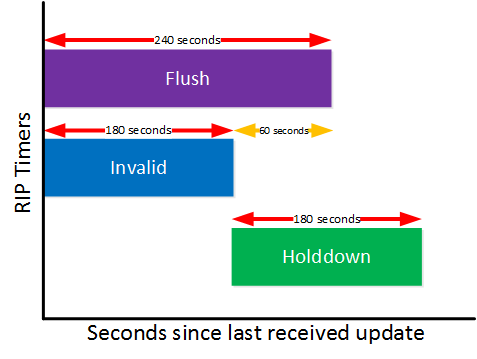

**~ The Sorcerer of the Wilde*rip*s ~** by Kai Ashante Wilson

---

# ROUTING INFORMATION PROTOCOL (RIP)

## SUMMARY

* A **distance-vector** routing protocol that uses **hop-count** as a metric to determine the best path in a network.
* **RIP** maximum hop count of 15, which limits possible network size.
* Simple to configure, using less processing power and storage compared to complex routing protocols.

- UPDATES
    * Broadcast their entire routing table to adjacent routers every 30 seconds.
    * Send "**triggered updates**", immediately if a change in the routing table occurs.

- HOP COUNT
    * A hop count of 16 or more is considered **infinite**, which indicates an unreachable network.
    * This limitation is to prevent routing **loops**. 

- TIMER
    * When a link goes down, a timer starts.
    * If no update is received, it is declared **invalid** and finally the route is **flushed** from the routing table.

    

- PROTOCOL TYPE
    * RIP is only aware of the "distance" (hop count) and the "vector" (next-hop router) to each destination.

- DISADVANTEAGE
    * Slow Convergence in large networks.
    * Limited Scalability.
    * Broadcasting the entire routing table is inefficient.
    * It can only use multiple paths if they have the exact same hop count.

- DEFAULTS

| **Feature** | **Default Setting** |
| - | - |
| Auto summary                    | Enabled RIPv1 automatically summarizes routes to their classful boundaries (/8, /16, /24), which can cause problems.|
| IP RIP authentication key-chain | No authentication Default mode : clear text|
| IP RIP triggered                | Disabled|
| IP split horizon                | Varies with media : prevents a router from advertising a route back out of the same interface from which it was learned to prevent **LOOPS** |
| Neighbor                        | None defined|
| Network                         | None specified|
| Offset list                     | Disabled|
| Output delay                    | 0 milliseconds : packet is waiting in the output queue of a network device before being transmitted (when communicating with slow devices)|
| Timers basic                    | • Update: 30 seconds : time between sending routing updates • Invalid: 180 seconds : after which a route is declared invalid • Hold-down: 180 seconds : before a route is removed from the routing table • Flush: 240 seconds : time for which routing updates are postponed|
| Validate-update-source          | Enabled|
| Version                         | Receives RIP Version 1 and 2 packets sends Version 1 packets|

---

## CONFIGURATIONS

**ENABLE RIP**
| **Command** | **Description** |
| - | - |
| `R1(config)# ip routing`                         | Enables IP routing on the router so it can forward packets between interfaces.|
| `R1(config)# router rip`                         | Starts the RIP routing process and enters RIP configuration mode.|
| `R1(config-router)# network 192.168.10.0`        | Specifies the network to advertise using RIP; interfaces within this network will send and receive RIP updates.|
| `R1(config-router)# neighbor 192.168.10.2`       | Manually defines a RIP neighbor for unicast updates instead of using broadcast or multicast.|
| `R1(config-router)# timers basic 45 360 400 300` | Adjusts RIP timers: **Update 45s**, **Invalid 360s**, **Holddown 400s**, **Flush 300s**.|
| `R1(config-router)# version 2`                   | Sets the router to use **RIP version 2**, which supports subnet masks and authentication.|
| `R1(config)# no router rip`                      | Disables the RIP process and removes all RIP-related configuration from the router.|

**OFFSET**
| **Command** | **Description** |
| - | - |
|`R1(config)# access-list 10 permit 192.168.10.0`   ||
|`R1(config)# router rip`                           ||
|`R1(config-router)# offset-list 10 out 2 eth0`     | Add 2 to the hop-count of any route to 192.168.10.0 going out of eth0|

**AUTHENTICATION**
| **Command** | **Description** |
| - | - |
|`R1(config)# key chain trees`                          | define a key chain named *trees*.|
|`R1(config-keychain)# key 1`                           | add a key to the chain.|
|`R1(config-keychain-key)# key-string Cisco123`         | define the key.|
|`R1(config)# interface f0/1`                           ||
|`R1(config-if)# ip rip authentication mode md5`        | set auth type {text / md5}.|
|`R1(config-if)# ip rip authentication key-chain trees` | use the key(s) from the chain *trees* to authenticate outgoing and incoming RIP updates.|

**ROUTE SUMMARIZATION**
| **Command** | **Description** |
| - | - |
|`R1(config)# interface f0/1`                                               ||
|`R1(config-if)# ip summary-address rip ip address 10.1.1.30 255.255.255.0` |summary network address that RIP will advertise out of this interface.|

**SPLIT HORIZON**
| **Command** | **Description** |
| - | - |
|`R1(config)# interface f0/1`               ||
|`R1(config-if)# no ip split horizon rip`   | disable split horizon. (ie. for hub and spoke topology)|

---

## MONITORING & MAINTENANCE

| **Command** | **Description** |
| - | - |
| `show ip protocols`       | Displays information about all routing protocols running on the router, including RIP version, timers, networks, neighbors, and administrative distance.|
| `show ip route`           | Displays the entire IP routing table — RIP-learned routes appear with an **"R"** prefix.|
| `show ip route rip`       | Filters the routing table to display only routes learned via RIP.|
| `show ip rip database`    | Shows the RIP routing database (the list of networks RIP is aware of and their sources).|
| `show ip interface brief` | Verifies which interfaces are up/up and can participate in RIP.|
| `show ip rip interface`   | Displays RIP status and settings on each interface (timers, version, authentication, etc.).|
| `show running-config`     | section `router rip` Displays the current RIP configuration (version, networks, timers, etc.).|
| `show interfaces`         | Displays interface-level details, useful for verifying RIP-enabled interfaces and their IP addresses.|
|||
| `debug ip rip`                | Displays all RIP routing updates being sent and received — useful for verifying route advertisement and reception.|
| `debug ip rip events`         | Shows RIP-related events (timers expiring, routes being added/removed). Less verbose than full `debug ip rip`.|
| `debug ip rip transactions`   | Displays packet-level information about RIP messages exchanged.|
| `undebug all` , `u all`       | Stops all debugging processes (important to prevent CPU overload).|
|||
| `clear ip route *`        | Clears the entire routing table; useful after major RIP or network topology changes.|
| `clear ip rip`            | Resets RIP process and clears learned routes, forces immediate re-advertisement.|
| `clear ip rip statistics` | Resets RIP statistics counters.|
| `clear ip rip neighbor`   | Resets communication with a specific RIP neighbor (if manually configured).|
| `clear counters`          | Clears all interface statistics (helpful to verify fresh packet counts during testing).|
