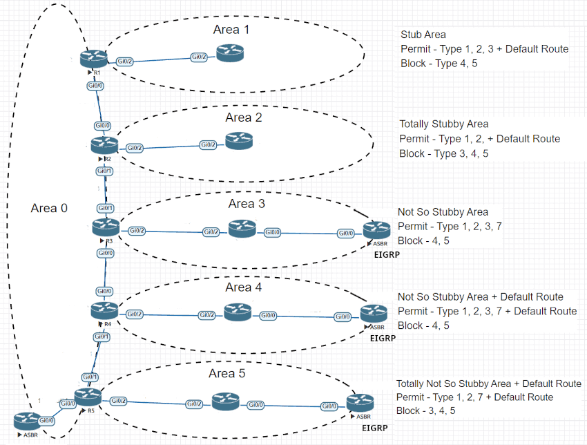
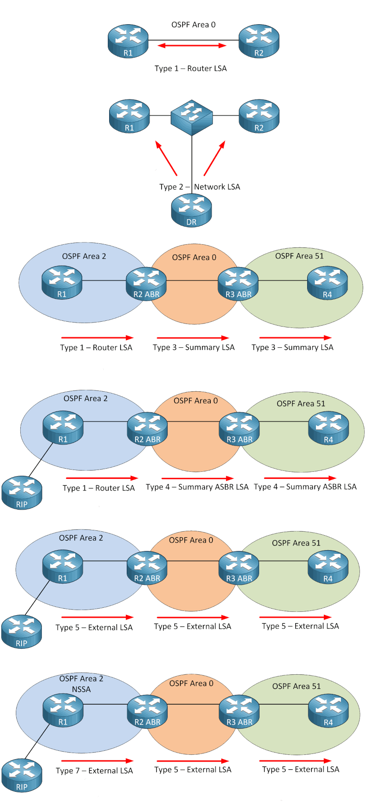
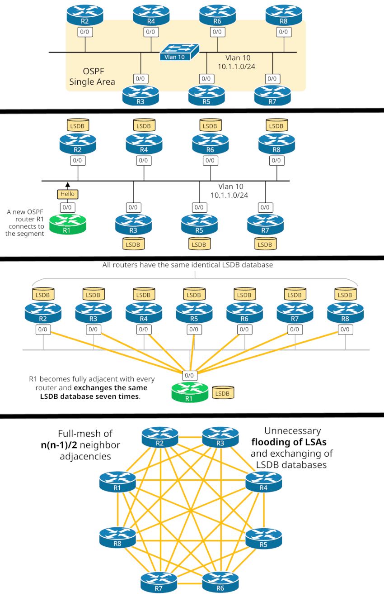
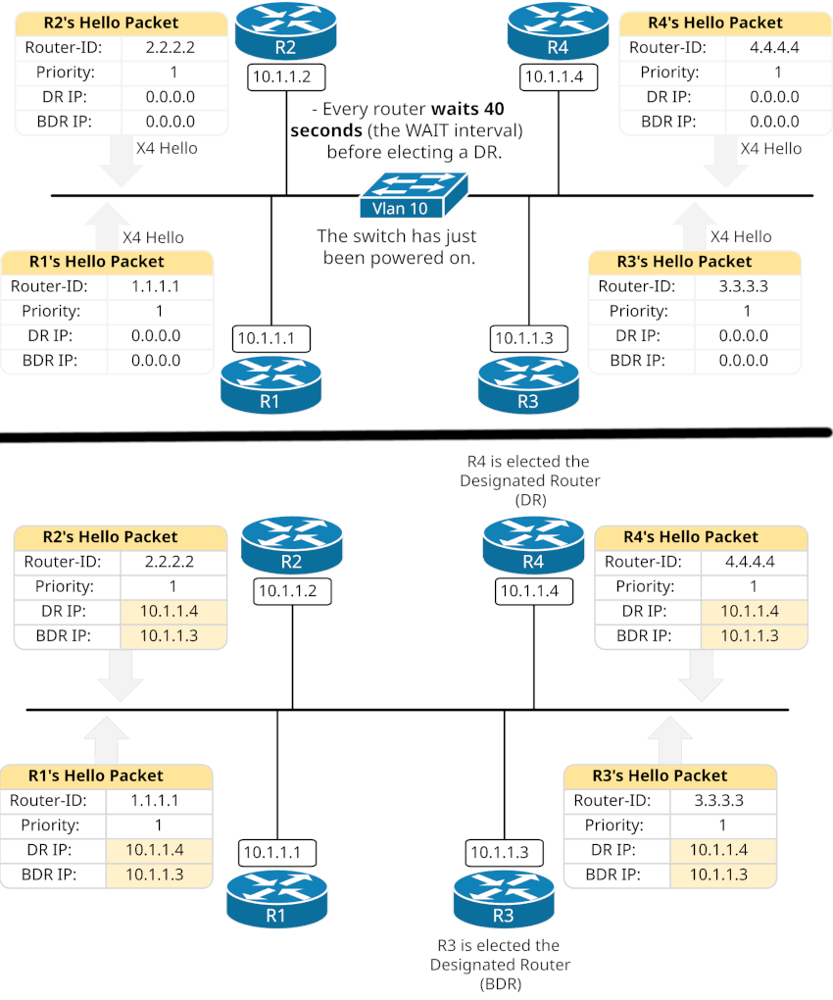
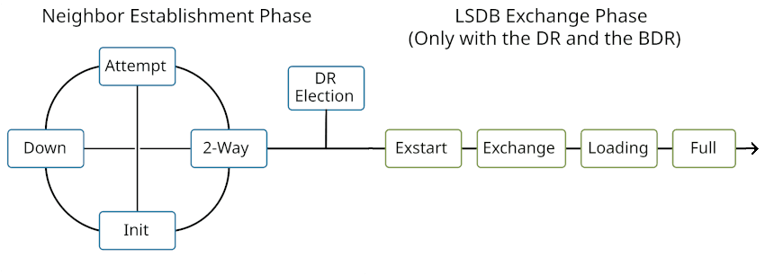
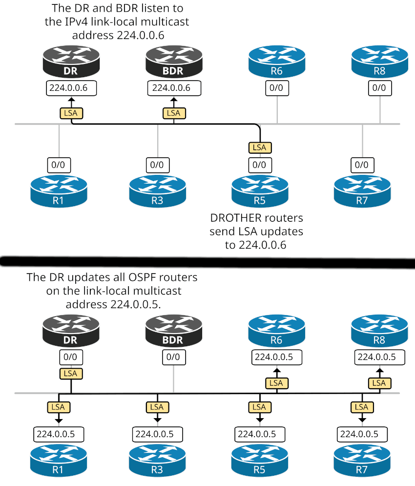
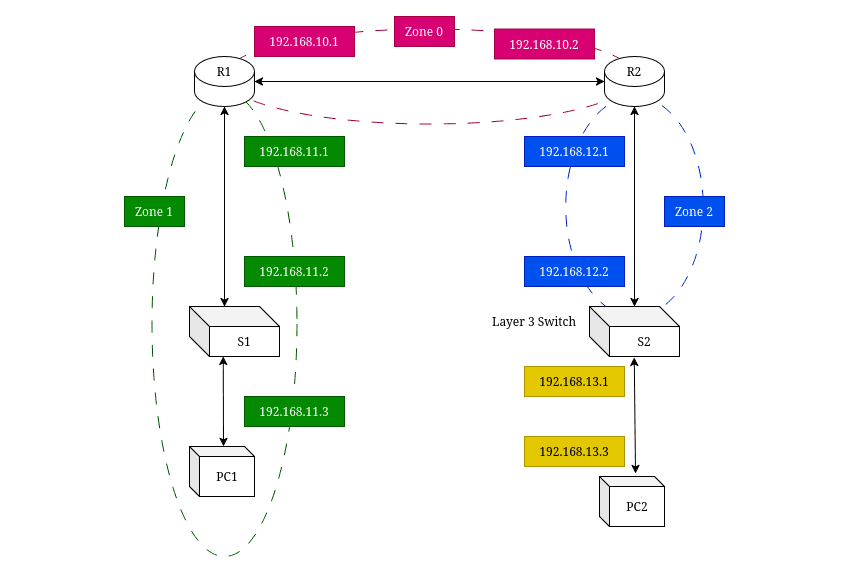
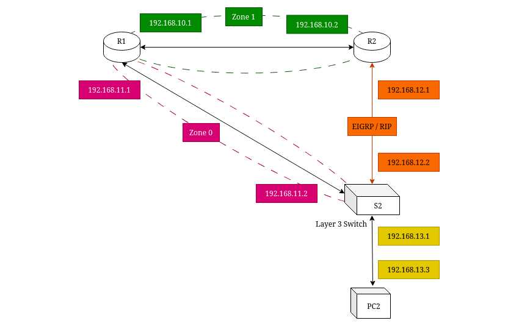

**~ The *Eigrp* of the World ~** <sub><sup>by Michael Pye</sup></sub>

---

# OPEN SHORTEST PATH FIRST (OSPF)

## SUMMARY

- link-state routing protocol with a very CPU-intensive algorithm.
- OSPF networks are divided into areas to simplify management and reduce overhead.
- Every OSPF network must have an **Area 0 (the backbone area)**.
- Other areas connect to the backbone through **Area Border Routers (ABRs)**.
- **OSPF packets** are used to manage the transmission of **LSAs**.
- **LSAs** are used to exchange detailed network topology information after an adjacency is formed.

---

**Types of OSPF packets**

| **Packet Type** | **Purpose** | **Used When** | **Information Contained** |
| - | - | - | - |
| **Type 1 Hello**                             | Discovers and maintains neighbor relationships.            | Sent periodically on all OSPF-enabled interfaces.                           | Router ID, Hello/dead intervals, Area ID, Neighbor list, Network mask.|
| **Type 2 Database Description (DBD)**        | Summarizes the contents of a router’s link-state database. | Exchanged when forming adjacencies after Hello packets.                     | LSA headers describing each entry in the LSDB (not full LSAs).|
| **Type 3 Link State Request (LSR)**          | Requests specific LSAs from a neighbor.                    | Sent after comparing DBD packets when a router needs newer or missing LSAs. | Type, ID, and Advertising Router of the requested LSAs.|
| **Type 4 Link State Update (LSU)**           | Delivers one or more complete LSAs.                        | Sent in response to LSRs or to flood new LSAs to neighbors.                 | One or more LSAs containing full link-state information.|
| **Type 5 Link State Acknowledgment (LSAck)** | Confirms receipt of LSAs.                                  | Sent after receiving LSUs to ensure reliable flooding.                      | LSA headers of acknowledged LSAs.|

---

**Types of LSAs**

| **LSA Type** | **Main Function**                   | **Generated By** | **Flooded Where**               |
| ------------ | ----------------------------------- | ---------------- | ------------------------------- |
| 1            | Advertise router’s local links      | Every router     | Inside an area                  |
| 2            | Advertise multi-access network info | DR               | Inside an area                  |
| 3            | Advertise inter-area routes         | ABR              | Between areas                   |
| 4            | Advertise route to ASBR             | ABR              | Between areas                   |
| 5            | Advertise external routes           | ASBR             | Entire OSPF domain              |
| 6            | Multicast group info                | MOSPF routers    | Inside area (rare)              |
| 7            | External routes in NSSA             | ASBR in NSSA     | NSSA only (converted to Type 5) |

| **Acronym** | | **Definition** |
| - | - | - |
| **LSA**   | *Link-State Advertisement*          | Packets that carry routing and topology information between OSPF routers.|
| **LSDB**  | *Link-State Database*               | The collection of all LSAs that describe the complete OSPF topology within an area. Every router in an area has an identical LSDBs.|
| **DR**    | *Designated Router*                 | Elected on multiaccess networks (like Ethernet) to reduce OSPF traffic. The DR represents the network and forms adjacencies with all other routers (instead of all routers talking to each other).|
| **BDR**   | *Backup Designated Router*          | The standby router that takes over if the DR fails. It listens to all updates but doesn’t act as DR until needed.|
| **ABR**   | *Area Border Router*                | A router that connects **two or more OSPF areas**, one of which must be the **backbone area (Area 0)**. It summarizes and redistributes routes between areas. (type 3 & 4)|
| **ASBR**  | *Autonomous System Boundary Router* | A router that connects an OSPF domain to an **external network or another routing protocol** (ie. BGP, RIP). (type 5 or Type 7 if NSSA).|
| **NSSA**  | *Not-So-Stubby Area*                | A special type of OSPF area that allows limited external routes (Type 7 LSAs) but still reduces routing overhead like a stub area.|

---

**OSPF AREAS**



---

**LSA PROPAGATION**



---

**DR and BDR**

**The Problem with OSPF --->**



To prevent this problem **Designated Router** system is used.\
Selecting a single router as the Designated Router and other routers only exchanging database information with the DR, unnessasery flooding is averted.

**Selecting the DR & BDR --->**

- By default, every router has Priority 1.
- A router with a higher priority value is eligible to be elected as the Designated Router (DR) on the VLAN segment. 
- A router with priority 0 is ignored in the election process. 
- If priorities are equal, the highest Router ID breaks the tie.

> ⦿ -> Each router **independently** runs the DR/BDR election using data from neighbor Hello packets, but identical algorithms ensure **everyone reaches same result**.\
> ⦿ -> Once elected, the DR retains its role until **it's** OSPF process restarts; even a new **higher-priority** router can't take over unless the current DR fails.



**Neighboring States --->**



```
R1# sh ip ospf neighbor
Neighbor ID     Pri   State           Dead Time   Address         Interface
2.2.2.2           1   2WAY/DROTHER    00:00:38    10.1.1.2        Ethernet0/0
3.3.3.3           1   2WAY/DROTHER    00:00:39    10.1.1.3        Ethernet0/0
4.4.4.4           1   2WAY/DROTHER    00:00:38    10.1.1.4        Ethernet0/0
```

```
R1# sh ip ospf neighbor
Neighbor ID     Pri   State           Dead Time   Address         Interface
2.2.2.2           1   2WAY/DROTHER    00:00:39    10.1.1.2        Ethernet0/0
3.3.3.3           1   FULL/BDR        00:00:32    10.1.1.3        Ethernet0/0
4.4.4.4           1   FULL/DR         00:00:31    10.1.1.4        Ethernet0/0
```

```
R1# sh ip ospf interface e0/0
Neighbor Count is 3, Adjacent neighbor count is 2 
    Adjacent with neighbor 3.3.3.3  (Backup Designated Router)
    Adjacent with neighbor 4.4.4.4  (Designated Router)
```

> ⦿ -> Two routers that are both **DROTHER** do not become **fully adjacent**. They become neighbors in a **2-WAY** state and stop there.

Reset both ***DR's and BDR's*** OSPF process to restart the election ---> `clear ip ospf process`\
***BECAUSE ! When the Designated Router fails, the Backup Designated Router takes over***

---

**LSA flooding process --->**



1. DROTHER routers send the LSA updates to the link-local multicast **224.0.0.6**. Only the DR and BDR listen to that multicast address.
2. When the DR receives an update, it resends it to the link-local multicast **224.0.0.5**. All OSPF routers listen to that address

---

**OSPF Network Types --->**

| **OSPF Network Type** | **Multicast Support** | **Hello Type** | **DR/BDR Election** | **Neighbor Discovery** | **Adjacency Type** | **Typical Use Case** |
| - | - | - | - | - | - | - |
| **Broadcast**                         |  Yes  | Multicast to 224.0.0.5 |  Yes | Automatic                   |  **DR/BDR only**     | Ethernet LANs.|
| **Non-Broadcast (NBMA)**              |  No   | Unicast                |  Yes | Manual (`neighbor` command) |  **DR/BDR only**     | Frame Relay (full/partial mesh).|
| **Point-to-Point**                    |  Yes  | Multicast to 224.0.0.5 |  No  | Automatic                   |  **single neighbor** | Serial links, GRE tunnels.|
| **Point-to-Multipoint Broadcast**     |  Yes  | Multicast to 224.0.0.5 |  No  | Automatic                   |  **each neighbor**   | Broadcast-capable networks without DR/BDR.|
| **Point-to-Multipoint Non-Broadcast** |  No   | Unicast                |  No  | Manual (`neighbor` command) |  **each neighbor**   | NBMA (Frame Relay, ATM).|

---

**IP Route Types --->**

`show ip route`

| **Code** | **Description** |
| - | - |
|O  |OSPF|
|IA |OSPF inter area|
|NI |OSPF NSSA external type 1|
|N2 |OSPF NSSA external type 2|
|E1 |OSPF external type 1|
|E2 |OSPF external type 2|

---

## CONFIGURATIONS

**Enabling OSPF**

```
R1(config)# router ospf 109
R1(config-router)# network 192.168.129.16 0.0.0.3 area 20
```

**OSPF Interface Parameters**

```
R1(config)# interface Gigabitethernet 0/0
R1(config-if)# ip ospf cost 65
R1(config-if)# ip ospf retransmit-interval 1
R1(config-if)# ip ospf transmit-delay
R1(config-if)# ip ospf priority 1
R1(config-if)# ip ospf hello-interval 1
R1(config-if)# ip ospf dead-interval 1
R1(config-if)# ip ospf authentication-key 1
R1(config-if)# ip ospf message-digest-key 1 md5 23456789
R1(config-if)# ip ospf authentication message-digest
```

**OSPF Multi-Area Configurations**

**CONFIGURATION 1**



Configure OSPF on R1

```
R1(config)# router ospf 1
R1(config-router)# network 192.168.10.0 0.0.0.255 area 0
R1(config-router)# network 192.168.11.0 0.0.0.255 area 1
```

Configure OSPF on R2

```
R2(config)# router ospf 1
R2(config-router)# network 192.168.10.0 0.0.0.255 area 0
R2(config-router)# network 192.168.12.0 0.0.0.255 area 2
```

Configure Routed Ports on S2

```
S2(config)# interface fa0/1
S2(config-if)# no switchport
S2(config-if)# ip address 192.168.12.2 255.255.255.0
S2(config-if)# no shut

S2(config)# interface fa0/2
S2(config-if)# no switchport
S2(config-if)# ip address 192.168.13.1 255.255.255.0
S2(config-if)# no shut
```

Configure OSPF on S2

```
S2(config)# router ospf 1
S2(config-router)# redistribute connected                   # add routes for the directly connected subnets on all the other IP interfaces into OSPF.
S2(config-router)# network 192.168.12.0 0.0.0.255 area 2
```

**CONFIGURATION 2**




Configure OSPF on R1

```
R1(config)# router ospf 1
R1(config-router)# network 192.168.10.0 0.0.0.255 area 1
R1(config-router)# network 192.168.11.0 0.0.0.255 area 0
```

Configure OSPF on R2

```
R2(config)# router ospf 1
R2(config-router)# redistribute RIP                         # add routes for the RIP subnets on all the other IP interfaces into OSPF.
R2(config-router)# network 192.168.10.0 0.0.0.255 area 1
```

Configure RIP on R2

```
R2(config)# router rip
R2(config-router)# network 192.168.12.0
R2(config-router)# version 2
```

Configure Routed Ports on S2

```
S2(config)# interface fa0/1
S2(config-if)# no switchport
S2(config-if)# ip address 192.168.12.2 255.255.255.0
S2(config-if)# no shut

S2(config)# interface fa0/2
S2(config-if)# no switchport
S2(config-if)# ip address 192.168.13.1 255.255.255.0
S2(config-if)# no shut

S2(config)# interface fa0/3
S2(config-if)# no switchport
S2(config-if)# ip address 192.168.11.2 255.255.255.0
S2(config-if)# no shut
```

Configure OSPF on S2 ( **No Redistribution** )
```
S2(config)# router ospf 1
S2(config-router)# network 192.168.10.0 0.0.0.255 area 1
```

Configure RIP on R2

```
S2(config)# router rip
S2(config-router)# network 192.168.12.0
S2(config-router)# version 2
```

---

## MONITORING & MAINTENANCE

| Command                              | Description                                                                                 |
| ------------------------------------ | ------------------------------------------------------------------------------------------- |
| `show ip ospf`                       | Displays general OSPF process information (process ID, router ID, SPF timers, areas, etc.). |
| `show ip ospf interface`             | Shows OSPF-related information for all interfaces (cost, state, DR/BDR, neighbors).         |
| `show ip ospf interface <interface>` | Displays detailed OSPF data for a specific interface.                                       |
| `show ip ospf neighbor`              | Displays all OSPF neighbors and their current adjacency states.                             |
| `show ip ospf neighbor detail`       | Gives detailed neighbor information (dead timer, priority, last state change).              |
| `show ip ospf database`              | Displays the OSPF LSDB (Link-State Database) — useful for checking LSAs.                    |
| `show ip ospf database router`       | Displays Router LSAs in the database.                                                       |
| `show ip ospf database network`      | Displays Network LSAs.                                                                      |
| `show ip ospf database summary`      | Displays Summary LSAs (Type 3 and Type 4).                                                  |
| `show ip ospf database external`     | Displays External LSAs (Type 5).                                                            |
|||
| `show ip route ospf` | Displays OSPF-learned routes in the routing table.                                           |
| `show ip protocols`  | Displays routing protocol configuration (OSPF process ID, networks, timers, redistribution). |
| `show ip cef`        | Checks if OSPF routes are installed in the forwarding table (CEF).                           |
|||
| `clear ip ospf process`        | Resets the OSPF process (restarts SPF calculation and adjacency formation). |
| `clear ip ospf neighbor`       | Clears OSPF neighbor relationships (forces re-adjacency).                   |
| `debug ip ospf events`         | Displays general OSPF events and state transitions.                         |
| `debug ip ospf adj`            | Displays adjacency formation messages.                                      |
| `debug ip ospf hello`          | Shows OSPF Hello packet exchanges.                                          |
| `debug ip ospf packet`         | Displays all OSPF packets being sent and received.                          |
| `debug ip ospf lsa-generation` | Shows when LSAs are generated and refreshed.                                |
| `debug ip ospf spf`            | Shows SPF calculation details (how OSPF builds the topology).               |
|||
| `show ip ospf border-routers` | Lists ABRs and ASBRs known to the router.                 |
| `show ip ospf virtual-links`  | Displays virtual link status (if any).                    |
| `show ip ospf sham-links`     | Displays OSPF sham links (used in MPLS VPN environments). |
| `show ip ospf traffic`        | Shows OSPF packet statistics (Hello, DBD, LSAs).          |
