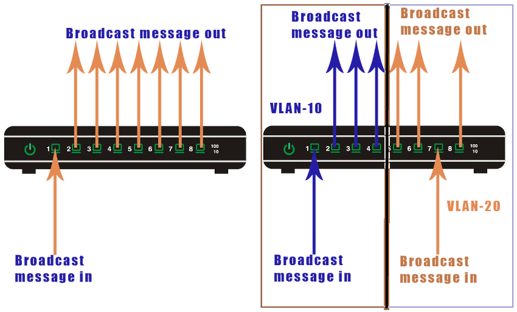
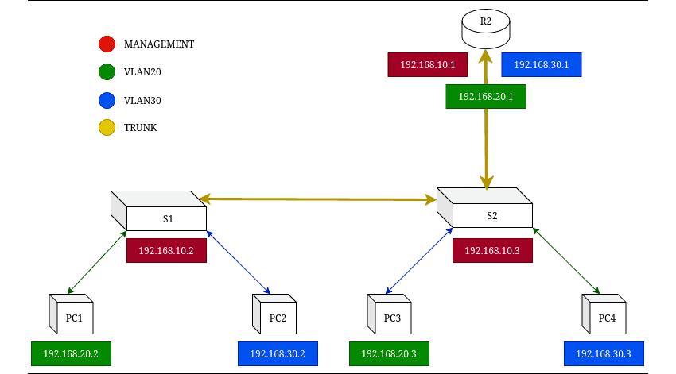

**~ Boy in a *Vlan* Room ~** <sub><sup>by Karl Olsberg</sup></sub>

---

# VIRTUAL LOCAL AREA NETWORKS (VLAN)

## SUMMARY

- Vlans split a network at Layer 2 while Subneting splits it at layer 3.
- VLANs are a switch only feature on Ethernet switches.
- VLANs create boundaries for broadcast messages.
- Devices in different VLANs cannot communicate directly. They can communicate through a router.
- You can create and use the same VLAN on multiple routers. This feature allows you to arrange devices logically.
- All switches have a default VLAN, called VLAN1. By default, all switch ports belong to VLAN1.
- **Each VLAN should be on its own subnet**.
    + If two VLANs shared the same IP subnet, their broadcast domains would overlap.
    + For inter Vlan routing to work properly, each VLAN must have a unique subnet.



---

## CONFIGURATIONS



**VLANs / TRUNKs / ROUTER-ON-A-STICK**

Switch --->

Create and Name VLANs

```
S1(config)# vlan 10
S1(config-vlan)# name MANAGEMENT

S1(config)# vlan 20

S1(config)# vlan 30
```

Configure Access Ports

```
S1(config)# interface fa0/1
S1(config-if)# switchport mode access
S1(config-if)# switchport access vlan 10
S1(config-if)# no shut

S1(config)# interface fa0/2
S1(config-if)# switchport mode access
S1(config-if)# switchport access vlan 20
S1(config-if)# no shut

S1(config)# interface fa0/3
S1(config-if)# switchport mode access
S1(config-if)# switchport access vlan 30
S1(config-if)# no shut
```

Configure Trunking Port

```
S1(config)# interface fa0/10
S1(config-if)# switchport mode trunk
S1(config-if)# no shut
```

Configure Trunking Port for the Router (only S2)

```
S1(config)# interface fa0/11
S1(config-if)# switchport mode trunk
S1(config-if)# no shut
```

---

Router --->

Creating Switched Virtual Interfaces (SVI)

```
R1(config)# interface G0/0/1.1              # Gateway for VLAN 10
R1(config-subif)# encapsulation dot1Q 1
R1(config-subif)# ip add 192.168.10.1 255.255.255.0
R1(config-subif)# exit

R1(config)# interface G0/0/1.2              # Gateway for VLAN 20
R1(config-subif)# encapsulation dot1Q 2
R1(config-subif)# ip add 192.168.20.1 255.255.255.0
R1(config-subif)# exit

R1(config)# interface G0/0/1.3              # Gateway for VLAN 30
R1(config-subif)# encapsulation dot1Q 2
R1(config-subif)# ip add 192.168.30.1 255.255.255.0
R1(config-subif)# exit
```

Configure Trunking Port

```
R1(config)# interface G0/0/1                # Trunk link to S2
R1(config-if)# no shut
R1(config-if)# end
```

---


**Inter-VLAN Routing With a Layer3 Switch**

Create the VLANs

```
S2(config)# vlan 12
S2(config-vlan)# name LAN12

S2(config-vlan)# vlan 13
S2(config-vlan)# name LAN13
```

Create the SVI VLAN Interfaces.

```
S2(config)# interface vlan 10
S2(config-if)# ip add 192.168.10.1 255.255.255.0
S2(config-if)# no shut

S2(config)# interface vlan 20
S2(config-if)# ip add 192.168.20.1 255.255.255.0
S2(config-if)# no shut
```

Configure Access Ports

```
S2(config)# interface fa0/1
S2(config-if)# switchport mode access
S2(config-if)# switchport access vlan 10

S2(config)# interface fa0/2
S2(config-if)# switchport mode access
S2(config-if)# switchport access vlan 20
```

Enable IP Routing

```
S2(config)# ip routing
```

---

## MONITORING & MAINTENANCE

| Command | Description |
| - | - |
| `show vlan brief`                             | Displays a summary of all VLANs, names, and assigned ports.|
| `show vlan id <vlan-id>`                      | Shows detailed info about a specific VLAN.|
| `show vlan name <vlan-name>`                  | Displays VLAN details by name.|
| `show interfaces vlan <vlan-id>`              | Displays interface details of a VLAN (SVI).|
| `show mac address-table vlan <vlan-id>`       | Displays MAC addresses learned on a VLAN.|
| `show spanning-tree vlan <vlan-id>`           | Verifies STP status for a VLAN.|
| `show interfaces switchport`                  | Displays switchport mode and VLAN assignments.|
| `show interfaces trunk`                       | Displays trunk status, encapsulation, and allowed VLANs.|
| `show interfaces <interface> switchport`      | Shows detailed mode, VLANs, and encapsulation for a specific interface.|
| `show interfaces <interface> trunk`           | Displays trunk info for one interface.|
| `show interface <interface>`                  | Displays detailed interface statistics (line status, errors, etc.).|
| `show cdp neighbors detail`                   | Displays neighboring devices and trunk links.|
| `show lldp neighbors detail`                  | Same as above (if LLDP is used).|
| `no vlan <vlan-id>`                           | Deletes a VLAN.|
| `switchport trunk allowed vlan <vlan-list>`   | Specifies VLANs allowed on trunk.|
| `switchport trunk native vlan <vlan-id>`      | Sets the native VLAN for untagged traffic.|
| `switchport nonegotiate`                      | Disables DTP (Dynamic Trunking Protocol) negotiation.|
| `no switchport trunk allowed vlan <vlan-id>`  | Removes VLAN from trunk.|
| `switchport trunk allowed vlan add <vlan-id>` | Adds VLAN(s) to trunk.|
| `clear counters <interface>`                  | Clears interface counters for troubleshooting.|
