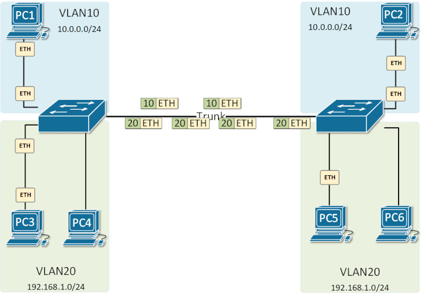

**~ *The 7½ *Trunks* of Evelyn Hardcastle ~** <sub><sup>by Stuart Turton</sup></sub>

---

# ETHERNET TRUNKING

## SUMMARY

Ethernet trunking (also called 802.1Q trunking) is a way to allow multiple VLANs to be carried over a single physical link
- Access port → belongs to only one VLAN.
- Trunk port → carries traffic for multiple VLANs.

Purpose of Trunking
- Reduces the number of physical links between switches.
- Allows VLANs to span across multiple switches.
- Required for inter-VLAN routing and VLAN management.

How it Works



- Trunking allows VLAN information to travel across a single link by **tagging each Ethernet frame** with a VLAN identifier.
- Trunking uses a VLAN tagging protocol ( **IEEE 802.1Q** ).
- When a frame from a VLAN passes through a trunk port:
    1. The switch adds a small tag (4 bytes) into the Ethernet frame header.
    2. That tag contains the VLAN ID (ie. VLAN 10, VLAN 20).
    3. The receiving switch reads the tag, knows which VLAN the frame belongs to, and forwards it accordingly.
    4. The tag is removed before the frame reaches the end device.

> 1 VLAN (usually VLAN 1 by default) can be configured as the **native VLAN**.\
> Frames from the native VLAN are **not tagged** when sent across the trunk.\
> This is mainly for **backward compatibility** with devices that don’t understand VLAN tags.

**VTP**

- **VTP (VLAN Trunking Protocol)** is a Cisco Layer 2 protocol that automatically distributes and synchronizes VLAN information across switches in the same domain.
- It keeps VLAN configurations consistent across all switches without manual setup.
- When a VLAN is created, deleted, or renamed on a VTP server, the change is advertised to other switches, which update their VLAN databases.
- A **VTP domain** is a group of switches with the same domain name that share VLAN information over trunk links.

| **Mode**            | **Description**                                                                           |
| ------------------- | ----------------------------------------------------------------------------------------- |
| **Server**          | Default mode; can create, modify, and delete VLANs.                                       |
| **Client**          | Cannot create/modify VLANs; receives VLAN info from a VTP server.                         |
| **Transparent**     | Doesn’t participate in VTP; passes VTP advertisements along. has it's own VLANs.          |
| **Off**             | Doesn’t send or forward any VTP messages.                                                 |

| **Term**                | **Description**                                                                                                                         |
| ----------------------- | --------------------------------------------------------------------------------------------------------------------------------------- |
| **VTP Advertisements**  | Periodic messages (every 5 minutes or on change) carrying VLAN information.                                                             |
| **VTP Revision Number** | A counter that indicates how recent the VLAN database is. Switches accept updates only from a higher revision number.                   |
| **VTP Pruning**         | A feature that limits VLAN traffic on trunk links to only those VLANs that are active on the destination switch — helps save bandwidth. |
| **VTP Password**        | Optional setting that secures the domain so only authenticated switches can exchange updates.                                           |

> ***!!!*** A newly added switch with a **higher revision number** (but empty VLAN database) can **erase VLANs across the network** when added to the domain.\
> Always reset the revision number (by changing the domain name twice) before connecting a new switch.

---

## CONFIGUARATION

**TRUNK CONFIGUARATION**
```
S1(config-if)# switchport trunk encapsulation dot1q
S1(config-if)# switchport mode trunk
S1(config-if)# switchport trunk allowed vlan 10,20,30
S1(config-if)# switchport trunk native vlan 99
S1(config-if)# switchport nonegotiate
```

**VTP CONFIGUARATION**
```
S1(config)# vtp domain CORP
S1(config)# vtp mode server
S1(config)# vtp password mySecret
S1(config)# vtp version 2
```

---

## MONITORING & MAINTENANCE

| **Category** | **Command** | **Description** |
| - | - | - |
| **View Trunk Status**        | `show interfaces trunk`                                     | Displays all trunk ports, encapsulation (802.1Q), allowed VLANs, and native VLANs.|
|                              | `show vlan brief`                                           | Lists VLANs configured on the switch and their associated ports.|
|                              | `show interfaces <interface> switchport`                    | Shows detailed VLAN and trunking information for a specific port.|
| **Verify Operational State** | `show interfaces status`                                    | Displays port status, VLAN assignment, speed, duplex, and port mode.|
|                              | `show running-config interface <interface>`                 | Shows the current configuration of the trunk port.|
| **Troubleshoot Trunking**    | `show interfaces <interface> trunk`                         | Checks encapsulation type and operational trunking status.|
|                              | `show interfaces <interface> counters errors`               | Displays error counters (useful for detecting tagging or cabling issues).|
|                              | `show interfaces <interface> stats`                         | Shows traffic statistics per interface for troubleshooting.|
|                              | `show cdp neighbors detail` or `show lldp neighbors detail` | Verifies neighboring devices and confirms trunk connection details.|
| **Maintenance**              | `clear counters interface <interface>`                      | Resets interface counters for fresh monitoring data.|
|                              | `switchport nonegotiate`                                    | Disables DTP negotiation to force static trunking.|
| **VTP**                      | `show vtp status`                                           | Displays VTP mode, domain name, and VLAN revision number to ensure VLAN consistency across trunks.|

**COMMON ISSUES -->**

| **Issue** | **Command** | **Description** |
| - | - | - |
| Trunk not forming            | `show interfaces trunk`                                     | Verify the port mode is trunk and encapsulation is 802.1Q.|
| VLAN not passing             | `show interfaces trunk`                                     | Ensure VLAN appears under “Vlans allowed and active on trunk.”|
| Native VLAN mismatch         | `show interfaces trunk`                                     | Check that native VLAN matches on both trunk ends.|
| VLAN missing                 | `show vlan brief`                                           | Confirm VLAN exists on both switches.|
| Errors on trunk              | `show interfaces counters errors`                           | Identify CRC/frame errors that may indicate tagging or physical issues.|
