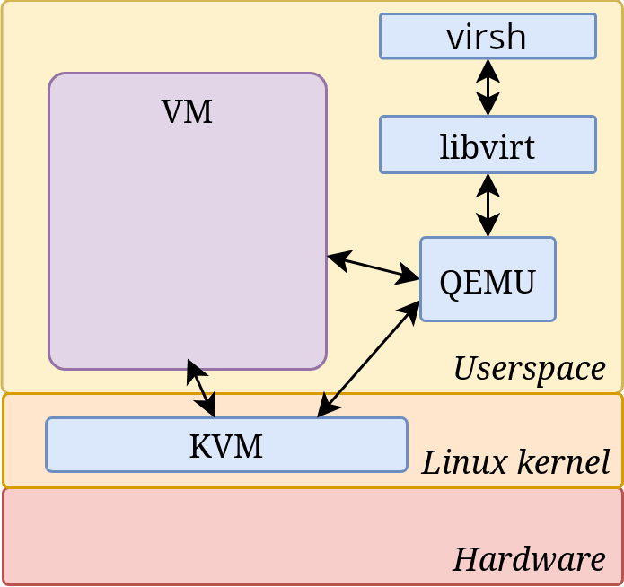

**~ A Tale of Two *PC*s ~** <sub><sup>by Charles Dickens</sup></sub>

---

# KVM SETUP



---

| **Section**        | **Details**|
| - | - |
| **BIOS / UEFI**    | Enable virtualization in BIOS/UEFI:  <br> - AMD processors : **SVM Mode** <br> - Intel processors : **Intel VT-x** or **VMX**|
| **COMPATIBILITY**  | Check virtualization support: <br> `grep -E --color=auto 'vmx\|svm\|0xc0f' /proc/cpuinfo` **OR** `LC_ALL=C.UTF-8 lscpu \| grep Virtualization` <br> *If no output: hardware virtualization not supported.*|
| **KERNEL MODULES** | Check if KVM modules are loaded: <br> `lsmod \| grep kvm`<br> If not loaded: <br>`modprobe kvm`<br> Then either: <br>`modprobe kvm_amd`*(AMD)* <br>`modprobe kvm_intel` *(Intel)* <br> KVM modules are builtin to the Arch kernel.|
| **INSTALL**        | Install :  <br> `pacman -S qemu libvirt virsh virt-install dnsmasq openbsd-netcat bridge-utils vde2 ebtables iptables` <br> **Component Purposes:** <br> - `virt-install`: VM initial setup <br> - `dnsmasq`: NAT/DHCP <br> - `openbsd-netcat`: remote SSH management <br> - `bridge-utils`: manage bridge devices <br> - `vde2`: virtual ethernet switch (VDE) <br> - `ebtables`: layer 2 filtering for vms <br> - `iptables`: firewall & NAT management |
| **START LIBVIRT**  | Enable and start libvirt: <br> `sudo systemctl enable libvirtd.service` <br> `sudo systemctl start libvirtd.service`|

---
> !!! REMEMBER TO USE **SUDO** WITH ***virsh***, ELSE SOME ITEMS WILL BE MISSING !!! COMMANDS WILL **NOT FAIL** AND THE USER WILL BE UNAWARE OF ANY ISSUE.
---

# THE POOL SETUP

> A pool is a location where storage volumes can be kept ( directory, network filesystem or partition including a LVMs )\
> default : */var/lib/libvirt/images/*

list Pools : `virsh pool-list --all`

create a PV : `pvcreate /dev/sdb1`

create a VG : `vgcreate kvm_pool /dev/sdb1`

> ! no need for a LV since, pools often use VGs directly rather than LVs.

create a pool.xml file :

```
<pool type='logical'>
  <name>pool_1</name>
  <source>
    <name>kvm_pool</name>
    <format type='lvm2'/>
  </source>
  <target>
    <path>/dev/kvm_pool</path>
  </target>
</pool>
```

define the pool : `virsh pool-define pool.xml`

start the pool : `virsh pool-start kvm_pool`

enable the pool : `virsh pool-autostart kvm_pool`

view pool details : `virsh pool-list --details`

---

# THE BRIDGE SETUP

show network connections : `nmcli con show`

create a new network bridge interface : `nmcli con add ifname br0 type bridge con-name br0`

adds **eth1** interface as a slave to existing **br0** bridge : `nmcli con add type bridge-slave ifname eth1 master br0`

disable **stp** on br0 : `nmcli con modify br0 bridge.stp no`

show **br0** information : `nmcli -f bridge con show br0`

diasble **eth1** interface : `nmcli con down "Wired connection 1"`
( **Wired connection 1** is the name of eth1 on `nmcli con show` list )

enable **br0** interface : `nmcli con up br0`

create *br0.xml* :

```
<network>
  <name>br0</name>
  <forward mode="bridge"/>
  <bridge name="br0"/>
</network>
```

define the bridge : `virsh net-define br0.xml`

start the bridge : `virsh net-start br0`

enable the bridge : `virsh net-autostart br0`

view bridge information : `virsh net-list --all`

---

# VM MANAGEMENT

Virsh uses :
- **libvirt** : group for communicating with dæmons running on a host as a privileged user.
- **KVM** : group gives users access to the /dev/kvm directory for full virtualization.

Add your user account to each group : `usermod -a -G libvirt,KVM robert`

Create a disk image : `qemu-img create -f qcow2 /dev/kvm_pool/arch.qcow2 32G`

Initiate a vm :

```
virt-install --name arch --ram 4096 \
--disk path=/var/lib/libvirt/images/arch.qcow2,size=20 \
--vcpus 2 \
--os-type linux \
--os-variant archlinux \ 
--network bridge=br0 \
--graphics none \ 
--console pty,target_type=serial \
--cdrom /var/lib/libvirt/images/archlinux-2018.02.01-x86_64.iso
```

> A virtual machine consists of the **disk image** file located in **/var/lib/libvirt/images** and the **XML file** that defines the VM.

list vms : `virsh list --all`

start vm : `virsh start arch`

shutdown vm : `virsh shutdown arch`

dump xml config : `virsh dumpxml arch > arch.xml`

restore vm : `virsh define arch.xml`

delete vm : `virsh undefine arch --remove-all-storage`

list network configurations : `virsh net-list --all`

edit network configurations :
- `virsh net-edit networkname`
- `virsh net-destroy networkname`
- `virsh net-start networkname`

---

# INSTALL ARCH

`timedatectl set-timezone Europe/Rome`

`timedatectl`

`fdisk -l`\
`fdisk /dev/vda`
> KVM still doesn't support UEFI, no need for a boot partition.\
> use an MBR partition table as BIOS MODE will be used in GRUB.

`mkswap /dev/vda1`\
`mkfs.ext4 /dev/vda2`

`mount /dev/vda2 /mnt`\
`swapon /dev/vda1`

`pacstrap -K /mnt base linux linux-firmware vim networkmanager grub sudo openssh`

`genfstab -U /mnt >> /mnt/etc/fstab`

`swapoff /dev/vda2`

`arch-chroot /mnt`

`ln -sf /usr/share/zoneinfo/Europe/Rome /etc/localtime`\
`hwclock --systohc`\
`locale-gen`\
`echo "LANG=en_US.UTF-8" > /etc/locale.conf`\
`echo "archVM" > /etc/hostname`

`passwd`\
`useradd -m username`\
`passwd username`

`vim /etc/sudoers`\
Add >> username ALL=(ALL) ALL

`grub-install /dev/vda`

---

## APP LIST

- net-tools
    + arp
    + hostname
    + ifconfig
    + ipmaddr
    + iptunnel
    + netstat
    + route
- bind
    + bind-tools
    + dns-server
    + dnsutils
- dnsmasq
- traceroute
- tcpdump
- wireshark-cli
- netcat
- nmap
- ethtool
- hping
- ansible
- python
- openssh
- fail2ban

---

## SETUP AN INDEPENDENT NETWORK CONNECTION

> the VM is usually connected to network though a **bridge** on the host.
> however there are several methods to establish an independent connection to the network.
> - if the adapter is exernal use USB passthrough.
> - if the adapter is internal use PCI passthrough.

**USB PASSTHROUGH**

Locate the USB device : `lsusb -v`

```
idVendor           0x17ef Lenovo
idProduct          0x480f Integrated Webcam [R5U877]
```

Create an XML file (ie. usb_device.xml)

```
    <hostdev mode='subsystem' type='usb' managed='yes'>
        <source>
            <vendor id='0x17ef'/>
            <product id='0x480f'/>
        </source>
    </hostdev>
```

Attach the device : `virsh attach-device GuestName --file usb_device.xml --config`
- next reboot : --config
- persistent : --persistent
- running domain : --current

Detach the device : `virsh detach-device GuestName --file usb_device.xml`
