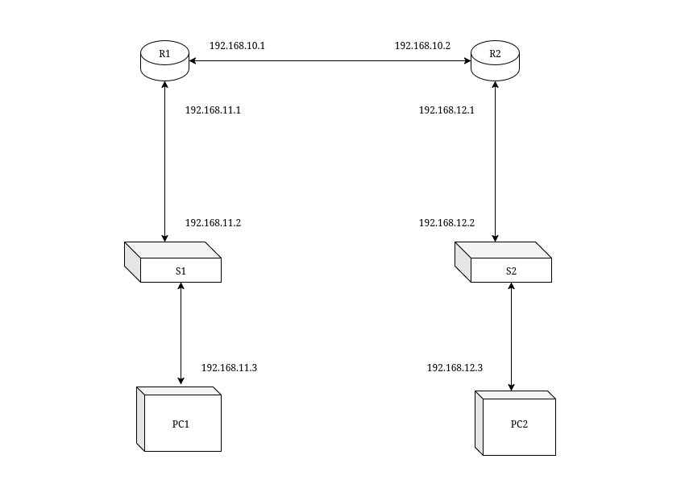

# SETUP

**DATE : 2024/01/03**

## EQUIPMENT

1. Router Cisco 1841 (64MB)
2. Router Cisco 1841 adventerprise k9 (64MB)
3. Switch Catalyst WS-C3750V2-24TS (24x)
4. Switch Catalyst WS-C2960-24TC-S (24x)

## SETUP

```
R1 : 	fastethernet0/0 : ip - 192.168.10.1 / 255.255.255.0 (R1-R2)
	    fastethernet0/1 : ip - 192.168.11.1 / 255.255.255.0 (R1-S1)
R2 : 	fastethernet0/0 : ip - 192.168.10.2 / 255.255.255.0 (R2-R1)
	    fastethernet0/1 : ip - 192.168.12.1 / 255.255.255.0 (R2-S2)

S1 :    vlan1 : ip - 192.168.11.2 / 255.255.255.0
S2 :    vlan1 : ip - 192.168.12.2 / 255.255.255.0

PC1 : dev : enp3s0 : ip - 192.168.11.3
PC2 : dev : enp3s0 : ip - 192.168.12.3
```



## CREDENTIALS ( • ᴗ - ) ✧

**ENABLE** : enable\
**USER** : admin\
**PASSWORD** : admin\
**DOMAIN** : admin.com

## FACTORY RESET

0. Establish a console connection and open the cli.
1. Power off the switch while keeping the console cli open.
2. Power on the switch & hold the mode button until recovery mode is shown on the cli.
3. `flash_init`
4. `dir flash:`
5. `del flash:vlan.dat`
6. `del flash:config.text`
7. `del flash:private-config.text` (if present)
8. `boot`

## INITIAL CONFIGURATION

```
Common >

configure terminal                        |enter config mode
(config)hostname NAME                     |change host name
(config)enable secret PASSWORD            |set enable password
(config)no ip domain-lookup               |stop looking for domains when a command is unrecognized

Switch S1 >

S1(config)# interface vlan 1                            |create a virtual host on the switch
S1(config-if)# ip address 192.168.11.2  255.255.255.0   |assign an IP address
S1(config-if)# no shut                                  |must turn it on
S1(config-if)# exit                                     |leave interface config and return to global config
S1(config)# ip default-gateway 192.168.11.1             |must be on same subnet as Mgt interface

Router R1 >

R1(config)# interface f0/1                              |enter configuration mode for an interface
R1(config-if)# ip address 192.168.11.1 255.255.255.0    |assign the IP Address and subnet mask
R1(config-if)# no shut                                  |turn on the interface
R1(config)# interface f0/0                              |enter configuration mode for an interface
R1(config-if)# ip address 192.168.10.1 255.255.255.0    |assign the IP Address and subnet mask
R1(config-if)# no shut                                  |turn on the interface

Router R2 >

R1(config)# interface f0/1                              |enter configuration mode for an interface
R1(config-if)# ip address 192.168.12.1 255.255.255.0    |assign the IP Address and subnet mask
R1(config-if)# no shut                                  |turn on the interface
R1(config)# interface f0/0                              |enter configuration mode for an interface
R1(config-if)# ip address 192.168.10.2 255.255.255.0    |assign the IP Address and subnet mask
R1(config-if)# no shut                                  |turn on the interface

Switch S2 >

S1(config)# interface vlan 1                            |create a virtual host on the switch
S1(config-if)# ip address 192.168.12.2  255.255.255.0   |assign an IP address
S1(config-if)# no shut                                  |must turn it on
S1(config-if)# exit                                     |leave interface config and return to global config
S1(config)# ip default-gateway 192.168.12.1             |must be on same subnet as Mgt interface
```
