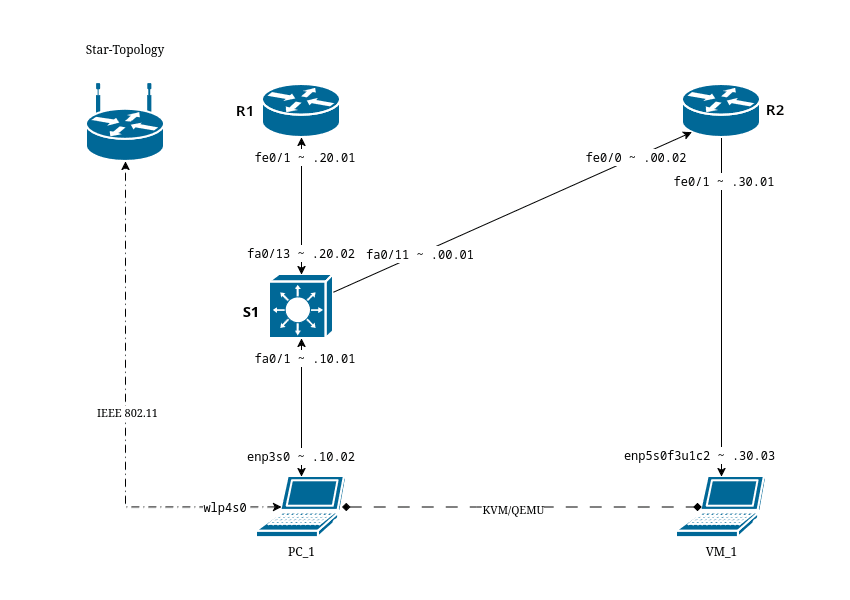
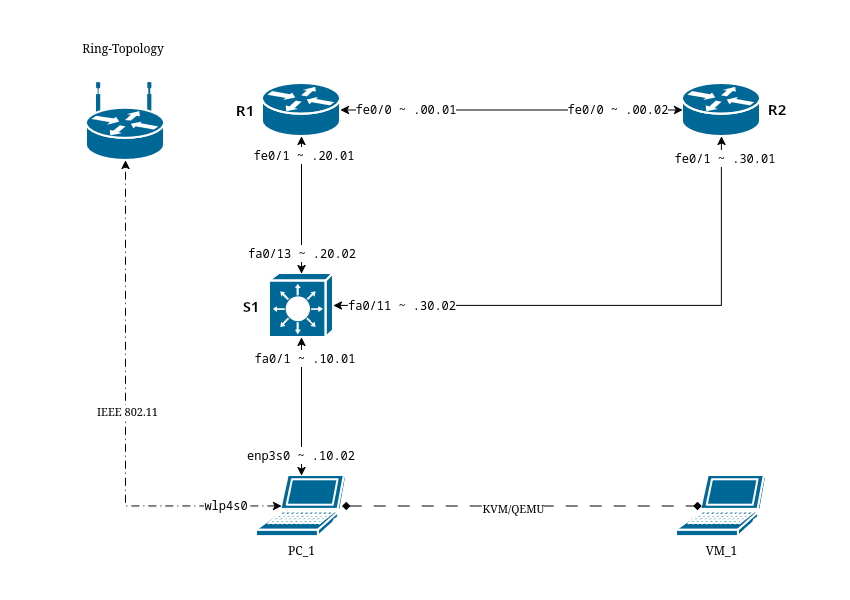
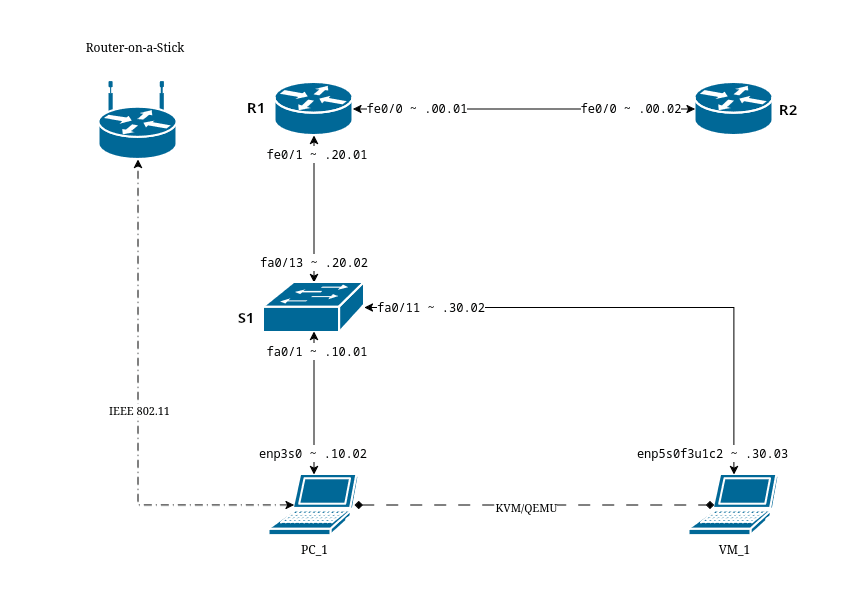

# SETUP

**DATE : 2025/06/10**

# BASELINE CONFIGUARTIONS

## PC

### MAINTENANCE

| **Category**  | **Description**  | **Command(s)**|
| - | - | - |
| **IP & Interface Status** | Show IP addresses, interface state, and link info | `ip a`  |
| **Network Devices (NMCLI)**  | Display detailed information about all network devices (driver, MAC, IP, state, etc.) | `nmcli dev show` |
| **Network Connections (NMCLI)** | List all configured connections (profiles) managed by NetworkManager| `nmcli con show` |

### MODIFY
```
nmcli con mod "CON_NAME" ipv4.addresses "192.168.10.2/24"
nmcli con mod "CON_NAME" ipv4.gateway "192.168.10.1"
nmcli con mod "CON_NAME" ipv4.dns "8.8.8.8 1.1.1.1"
nmcli con mod "CON_NAME" ipv4.method manual
```

### RESET
```
nmcli con down "CON_NAME"
nmcli con up "CON_NAME"
```

-----

## SWITCH

### MAINTENANCE

| **Category**| **Description** | **Command(s)**|
| - | - | - |
| **Interfaces** | Interface Status Summary | `show ip interface brief` |
| | Check for Errors on Interfaces | `show interfaces counters errors`<br>`show interfaces status` |
| | Check a Specific Interface  | `show interface GigabitEthernet1/0/1` |
| **VLAN & Trunking**  | VLAN Table| `show vlan brief`|
| | Trunk Ports  | `show interfaces trunk`|
| **Spanning Tree Protocol** | STP Summary  | `show spanning-tree summary` |
| | STP per VLAN | `show spanning-tree vlan 10` |
| | STP Root Bridge | `show spanning-tree root` |
| **Neighborhood**  | MAC Table | `show mac address-table`  |
| | MAC Table per Interface  | `show mac address-table interface GigabitEthernet1/0/2` |
| | ARP Table | `show arp` |
| | CDP Neighbors| `show cdp neighbors`<br>`show cdp neighbors detail`  |
| | LLDP Neighbors  | `show lldp neighbors`<br>`show lldp neighbors detail`|
| **Hardware & System Info** | Device Status| `show inventory`<br>`show environment all`<br>`show power`<br>`show environment fan`<br>`show environment temperature` |
| | Configuration Files| `show running-config`<br>`show startup-config` |
| **Security**| Port Security| `show port-security`<br>`show port-security interface GigabitEthernet1/0/10` |
| | DHCP Snooping| `show ip dhcp snooping`|
| | Dynamic ARP Inspection| `show ip arp inspection`  |
| | Logging| `show logging`|
| **Performance**| Utilization  | `show interfaces counters`<br>`show interfaces summary` |

### MODIFY

| **Category**| **Description**| **Command(s)** |
| - | - | - |
| **Mode Entry** | Enter privileged and global config modes  | `enable`<br>`configure terminal` |
| **Basic Identity Settings**| Set hostname, disable DNS lookup, configure domain | `hostname SW-CORE-01`<br>`no ip domain-lookup`<br>`ip domain-name COMPANY.LOCAL` |
| **AAA & Admin Access**  | Enable AAA, local authentication, admin user, enable secret | `aaa new-model`<br>`aaa authentication login default local`<br>`aaa authorization exec default local`<br>`username NETADMIN privilege 15 secret STRONG_ADMIN_PASSWORD`<br>`enable secret STRONG_ENABLE_SECRET` |
| **Logging & Time**| Syslog, timestamps, NTP, timezone| `service timestamps debug datetime msec`<br>`service timestamps log datetime msec`<br>`logging buffered 16000 warnings`<br>`logging host X.X.X.X`<br>`logging trap warnings`<br>`ntp server Y.Y.Y.Y prefer`<br>`ntp update-calendar`<br>`clock timezone UTC 0` |
| **SSH Security**  | Enable RSA keys, SSH version, timeout, retries  | `crypto key generate rsa modulus 2048`<br>`ip ssh version 2`<br>`ip ssh time-out 60`<br>`ip ssh authentication-retries 3`  |
| **Management Interface**| Set management VLAN + IP, gateway| `interface vlan 99`<br>`description *** MANAGEMENT VLAN ***`<br>`ip address 10.10.99.10 255.255.255.0`<br>`no shutdown`<br>`ip default-gateway 10.10.99.1`  |
| **Console Access**| Secure console line  | `line console 0`<br>`logging synchronous`<br>`exec-timeout 5 0`<br>`transport preferred none`<br>`password CONSOLE_PASSWORD`<br>`login local`|
| **VTY Access** | Secure remote access (SSH only)  | `line vty 0 4`<br>`exec-timeout 10 0`<br>`transport input ssh`<br>`login local`<br>`line vty 5 15`<br>`exec-timeout 10 0`<br>`transport input ssh`<br>`login local`  |
| **Disable Unused Services**| Disable CDP, HTTP/S servers, redirects | `no cdp run`<br>`no ip http server`<br>`no ip http secure-server`<br>`no ip redirects`<br>`no ip unreachables` |
| **STP Security**  | Harden spanning tree | `spanning-tree mode rapid-pvst`<br>`spanning-tree portfast default`<br>`spanning-tree bpduguard default` |
| **Unused Ports**  | Shut down ports and place in blackhole VLAN  | `interface range GigabitEthernet1/0/2 - 48`<br>`description *** UNUSED ***`<br>`switchport mode access`<br>`switchport access vlan 999`<br>`shutdown`<br>`interface vlan 999`<br>`description *** BLACKHOLE VLAN ***`<br>`no ip address`  |
| **DHCP Snooping / DAI / Source Guard** | Enable L2 security| `ip dhcp snooping`<br>`ip dhcp snooping vlan 1,10,20,30,99`<br>`ip arp inspection vlan 1,10,20,30,99`<br>`interface range GigabitEthernet1/0/1 - 48`<br>`ip dhcp snooping trust`<br>`ip arp inspection trust`<br>`spanning-tree portfast`<br>`spanning-tree bpduguard enable` |
| **SNMPv3 Monitoring**| Secure SNMP | `snmp-server group SECURE-GRP v3 priv`<br>`snmp-server user SECADMIN SECURE-GRP v3 auth sha SNMP_AUTH_PASSWORD priv aes 256 SNMP_PRIV_PASSWORD`<br>`snmp-server host 10.10.10.5 version 3 priv SECADMIN` |
| **Save Configuration**  | Save running configuration | `end`<br>`write memory` |

- ✔ Hardened access (AAA, SSH, least privilege)
- ✔ Unused services disabled (CDP, HTTP server, redirects)
- ✔ STP hardened globally (portfast + bpduguard)
- ✔ DHCP Snooping, Dynamic ARP Inspection, IP Source Guard
- ✔ Secure NTP & logging
- ✔ Blackhole VLAN + shutdown unused ports
- ✔ SNMPv3 only (encrypted)
- ✔ Separate mgmt VLAN and out-of-band design

-----
## ROUTER

### MAINTENANCE

| **Category** | **Description** | **Command(s)**  |
| - | - | - |
| **Interfaces**  | Interface Status Summary | `show ip interface brief`|
|  | Check for Errors on Interfaces | `show interfaces counters errors`<br>`show interfaces status`|
|  | Check a Specific Interface  | `show interface GigabitEthernet1/0/1`|
| **Routing**  | Routing Table| `show ip route` |
|  | Routing Protocols Running| `show ip protocols`|
|  | OSPF Monitoring | `show ip ospf`<br>`show ip ospf neighbor`<br>`show ip ospf interface`<br>`show ip ospf database` |
|  | EIGRP Monitoring| `show ip eigrp neighbors`<br>`show ip eigrp topology`  |
|  | BGP Monitoring  | `show ip bgp summary`<br>`show ip bgp`<br>`show ip bgp neighbors`  |
| **Neighbor Discovery**| ARP Table | `show ip arp`|
|  | NAT Monitoring  | `show ip nat statistics`<br>`show ip nat translations` |
|  | CDP | `show cdp neighbors`<br>`show cdp neighbors detail` |
|  | LLDP| `show lldp neighbors`<br>`show lldp neighbors detail`  |
| **WAN / VPN Monitoring** | IP SLA | `show ip sla summary`<br>`show ip sla statistics`|
|  | IPSec VPN | `show crypto isakmp sa`<br>`show crypto ipsec sa`|
| **System**| Identity  | `show version`<br>`show inventory`<br>`show platform`  |
|  | CPU Usage | `show processes cpu`<br>`show processes cpu history`|
|  | Memory | `show processes memory`<br>`show memory statistics` |
|  | Environment  | `show environment all`|
| **Logging**  | System Logs  | `show logging`  |
|  | Crash & Error Info | `show stacks`<br>`show version`|
| **Security Monitoring**  | ACLs| `show access-lists`|
|  | Zone-Based Firewall (ZBFW)  | `show zone security`<br>`show zone-pair security`<br>`show policy-map type inspect zone-pair` |
|  | Control Plane Policing (CoPP)  | `show policy-map control-plane`|

### MODIFY

| **Category** | **Description**  | **Command(s)** |
| - | - | -- |
| **Mode Entry**  | Enter privileged and global config modes | `enable`<br>`configure terminal` |
| **Basic System Settings**| Set hostname, disable DNS, configure domain | `hostname RTR-EDGE-01`<br>`no ip domain-lookup`<br>`ip domain-name COMPANY.LOCAL`|
| **AAA + Role-Based Access** | Enable AAA, local login, exec authorization, admin account, enable secret | `aaa new-model`<br>`aaa authentication login default local`<br>`aaa authorization exec default local`<br>`username NETADMIN privilege 15 secret STRONG_ADMIN_PASSWORD`<br>`enable secret STRONG_ENABLE_SECRET` |
| **Logging & Time Services** | Timestamps, syslog, NTP| `service timestamps debug datetime msec`<br>`service timestamps log datetime msec`<br>`logging buffered 51200 warnings`<br>`logging host 10.10.10.30`<br>`logging trap warnings`<br>`ntp server 10.10.20.20 prefer`<br>`ntp update-calendar`<br>`clock timezone UTC 0`  |
| **SSH Security**| Enable RSA keys, SSH settings| `crypto key generate rsa modulus 2048`<br>`ip ssh version 2`<br>`ip ssh time-out 60`<br>`ip ssh authentication-retries 3`  |
| **Interface Hardening — WAN**  | Secure WAN interface| `interface GigabitEthernet0/0`<br>`description *** WAN Uplink ***`<br>`ip address 203.0.113.2 255.255.255.252`<br>`no ip redirects`<br>`no ip unreachables`<br>`no ip proxy-arp`<br>`ip verify unicast source reachable-via rx`<br>`no shut` |
| **Interface Hardening — LAN**  | Secure LAN interface| `interface GigabitEthernet0/1`<br>`description *** LAN ***`<br>`ip address 10.1.1.1 255.255.255.0`<br>`no ip redirects`<br>`no ip unreachables`<br>`no ip proxy-arp`<br>`ip verify unicast source reachable-via rx`<br>`no shut` |
| **Routing (OSPF Example)**  | Configure OSPF| `router ospf 100`<br>`router-id 1.1.1.1`<br>`network 10.1.1.0 0.0.0.255 area 0`<br>`passive-interface default`<br>`no passive-interface GigabitEthernet0/1` |
| **Static Route**| Default route | `ip route 0.0.0.0 0.0.0.0 203.0.113.1` |
| **Zone-Based Firewall (ZBFW)** | Security zones, class-map, policies, zone-pair | `zone security LAN`<br>`zone security WAN`<br>`class-map type inspect match-any CM-LAN-TO-WAN`<br>`match protocol tcp`<br>`match protocol udp`<br>`match protocol icmp`<br>`policy-map type inspect PM-LAN-TO-WAN`<br>`class type inspect CM-LAN-TO-WAN` `inspect`<br>`class class-default` `drop`<br>`zone-pair security ZP-LAN-WAN source LAN destination WAN`<br>`service-policy type inspect PM-LAN-TO-WAN`<br>`interface GigabitEthernet0/1` `zone-member security LAN`<br>`interface GigabitEthernet0/0` `zone-member security WAN` |
| **SNMPv3 Secure Monitoring**| Encrypted SNMP config  | `snmp-server group SECURE-GRP v3 priv`<br>`snmp-server user SECADMIN SECURE-GRP v3 auth sha SNMP_AUTH_PASSWORD priv aes 256 SNMP_PRIV_PASSWORD`<br>`snmp-server host 10.10.10.31 version 3 priv SECADMIN`|
| **DHCP Server (Optional)**  | DHCP exclusions and pool  | `ip dhcp excluded-address 10.1.1.1 10.1.1.50`<br>`ip dhcp pool BRANCH-LAN`<br>`network 10.1.1.0 255.255.255.0`<br>`default-router 10.1.1.1`<br>`dns-server 8.8.8.8 1.1.1.1`|
| **Console Hardening** | Secure local console| `line console 0`<br>`exec-timeout 5 0`<br>`logging synchronous`<br>`password CONSOLE_PASSWORD`<br>`login local`|
| **VTY Hardening**  | Remote access via SSH only| `line vty 0 4`<br>`exec-timeout 10 0`<br>`transport input ssh`<br>`login local`  |
| **Disable Unused Services** | Disable insecure or unnecessary services | `no ip http server`<br>`no ip http secure-server`<br>`no cdp run`<br>`no lldp run`<br>`service tcp-keepalives-in`<br>`service tcp-keepalives-out`  |
| **Save Configuration**| Write config to NVRAM  | `end`<br>`write memory` |

Security
- ✔ AAA with local users
- ✔ SSHv2 only
- ✔ ZBFW for modern firewalling
- ✔ IP spoofing protections (uRPF)
- ✔ Disabled insecure services (HTTP/HTTPS/CDP)

Network Reliability
- ✔ NTP w/ timestamps
- ✔ SNMPv3 encrypted monitoring

Operational Best Practices
- ✔ Logging to syslog
- ✔ Role-based account separation
- ✔ Consistent interface hardening
- ✔ Exec timeouts for sessions

-----

# TOPOLOGIES

**CONFIGUARATION I**


PC_1
```
nmcli con mod "enp3s0" ipv4.addresses "192.168.10.2/24" ipv4.gateway "192.168.10.1" ipv4.method manual
nmcli con down "enp3s0"
nmcli con up "enp3s0"
```
VM_1
```
nmcli con mod "enp5s0f3u1c2" ipv4.addresses "192.168.10.2/24" ipv4.gateway "192.168.10.1" ipv4.method manual
nmcli con down "enp5s0f3u1c2"
nmcli con up "enp5s0f3u1c2"
```
S_1
```
conf t
ip routing

interface FastEthernet0/13
 no switchport
 ip address 192.168.20.2 255.255.255.0
 no shutdown

interface FastEthernet0/1
 no switchport
 ip address 192.168.10.1 255.255.255.0
 no shutdown

ip route 0.0.0.0 0.0.0.0 192.168.20.1

end
write memory
```
R_1
```
conf t

interface FastEthernet0/1
 ip address 192.168.20.1 255.255.255.0
 no shutdown

interface FastEthernet0/0
 ip address 192.168.0.1 255.255.255.0
 no shutdown

ip route 192.168.30.0 255.255.255.0 192.168.0.2

ip route 0.0.0.0 0.0.0.0 192.168.0.2

end
write memory
```
R_2
```
conf t

interface FastEthernet0/0
 ip address 192.168.0.2 255.255.255.0
 no shutdown

interface FastEthernet0/1
 ip address 192.168.30.1 255.255.255.0
 no shutdown

ip route 192.168.20.0 255.255.255.0 192.168.0.1

end
write memory
```
S_2
```
conf t

vlan 30
 name LAN-30
exit

interface vlan 30
 ip address 192.168.30.2 255.255.255.0
 no shutdown

interface FastEthernet0/13
 switchport mode access
 switchport access vlan 30
 no shutdown

interface range Fa0/1 - 12 , Fa0/14 - 24
 switchport mode access
 switchport access vlan 30
 no shutdown

ip default-gateway 192.168.30.1

end
write memory
```

**CONFIGUARATION II**



**CONFIGUARATION III**



**CONFIGUARATION IV**


