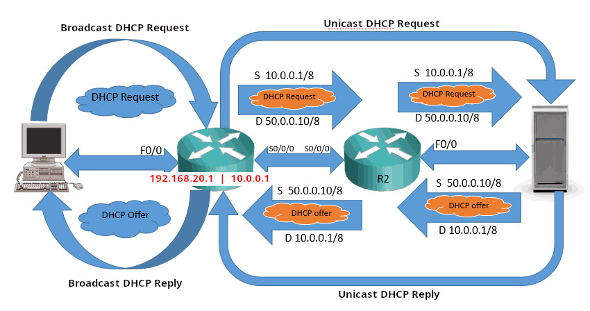

# DHCP

## SUMMARY

**Automatically** assign IP addresses and other network configuration parameters (like subnet mask, gateway, and DNS server) to devices on a network.

1. DHCP Discover – The device sends a broadcast message asking if any DHCP server is available.
2. DHCP Offer – A DHCP server replies with an available IP address and configuration info.
3. DHCP Request – The device requests to use the offered IP address.
4. DHCP Acknowledgment – The server confirms and assigns that IP address for a specific lease time.

**DHCP Relay Agent** forwards DHCP packets between clients and servers (through different subnets).



- DHCP clients always uses the local broadcast address to send a DHCP request.
- When a router’s interface receives a DHCP broadcast from a local subnet, it forwards the message to the DHCP server if DHCP relay is configured; otherwise, it discards it.
- Because routers forward only unicast traffic, the interface encapsulates the broadcast DHCP message into a unicast packet before sending it to the server.
- Upon receiving the unicast message, the DHCP server recognizes it came from a relay and not a client, since clients don’t send **unicast** DHCP requests.
- The server uses the source IP of the relay (e.g., 10.0.0.1/8) to identify the client’s subnet and match it with the corresponding DHCP pool.
- The server then selects an available IP configuration from that pool, wraps it in a unicast message, and sends it back to the relay.
- Finally, the relay converts the unicast reply into a local broadcast, allowing the original client to receive the DHCP offer.

## CONFIGURATION

**SERVER (ARCH)**

1 - Install the DHCP server package.
```
sudo pacman -Syu dhcp
```

2 - Edit the DHCP server configuration.

/etc/dhcpd.conf
```
# Global options
default-lease-time 600;
max-lease-time 7200;
authoritative;

# Subnet configuration
subnet 192.168.10.0 netmask 255.255.255.0 {
  range 192.168.10.100 192.168.10.200;
  option routers 192.168.10.1;
  option subnet-mask 255.255.255.0;
  option domain-name-servers 8.8.8.8, 1.1.1.1;
  option domain-name "local.lan";
}
```

3 - Specify the network interface.

/etc/conf.d/dhcpd
```
DHCPD_IFACE="enp0s8"
```

4 - Enable and start the service.
```
sudo systemctl enable dhcpd4.service
sudo systemctl start dhcpd4.service
```

**DHCP Relay**

```
Router(config)# interface GigabitEthernet0/0
Router(config-if)# ip address 192.168.10.1 255.255.255.0
Router(config-if)# ip helper-address 10.0.0.5
Router(config-if)# no shutdown
```

`ip helper-address` also forwards other UDP services like DNS. This can be prevented.

```
Router(config-if)# no ip forward-protocol udp dns
```

---

## MONITORING & MAINTENANCE

Verify Service Status
```
sudo systemctl status dhcpd4.service
```

Check DHCP Leases
```
cat /var/lib/dhcp/dhcpd.leases

OR

sudo journalctl -u dhcpd4.service -f
```