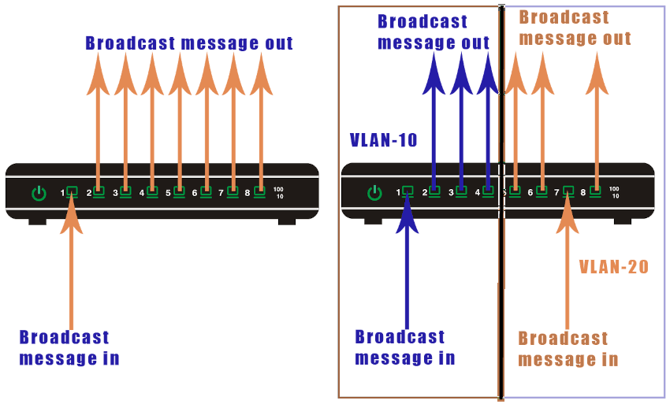
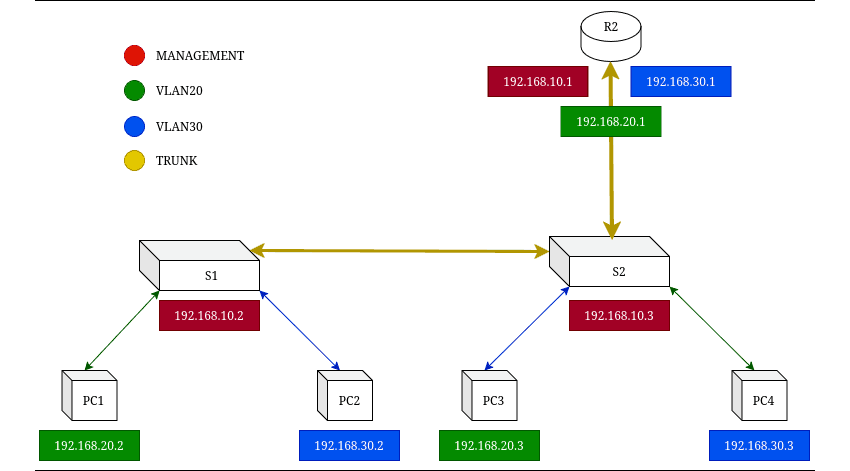
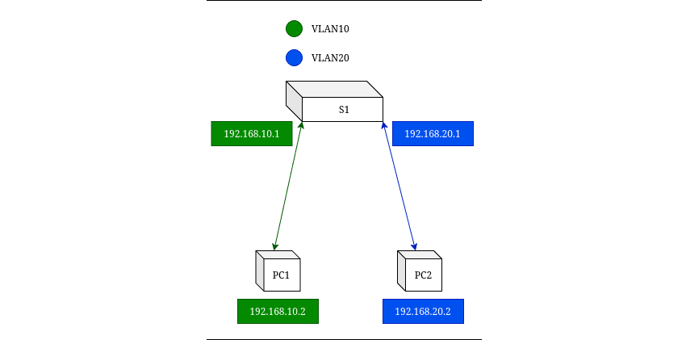

**~ Boy in a *Vlan* Room ~** <sub><sup>by Karl Olsberg</sup></sub>

---

# VIRTUAL LOCAL AREA NETWORKS (VLAN)

## SUMMARY

- Vlans split a network at Layer 2 while Subneting splits it at layer 3.
- VLANs are a switch only feature on Ethernet switches.
- VLANs create boundaries for broadcast messages.
- Devices in different VLANs cannot communicate directly. They can communicate through a router.
- You can create and use the same VLAN on multiple routers. This feature allows you to arrange devices logically.
- All switches have a default VLAN, called VLAN1. By default, all switch ports belong to VLAN1.
- **Each VLAN should be on its own subnet**.
    + If two VLANs shared the same IP subnet, their broadcast domains would overlap.
    + For inter Vlan routing to work properly, each VLAN must have a unique subnet.



---

**VxLAN (Virtual eXtensible LAN)**

VXLAN is a network overlay that extends Layer 2 networks over Layer 3 infrastructure, solving VLAN scalability limits.

It replaces 12-bit VLAN IDs (4,096 networks) with 24-bit VXLAN Network Identifiers (VNIs), supporting up to 16 million virtual networks.

VXLAN encapsulates Ethernet frames in **UDP** packets (port 4789) so they can traverse IP networks

```
[Outer Ethernet Header]
[Outer IP Header]
[UDP Header]    --> (default port 4789)
[VXLAN Header]  --> (contains 24-bit VNI)
[Original Ethernet Frame]
```
A VTEP is a device or software component that performs encapsulation and decapsulation and It has,
- An IP address on the underlay (physical) network.
- A mapping table between MAC addresses and VTEP IPs.

Originally, VXLAN relied on flood-and-learn (traditional Ethernet), but this doesn’t scale well.\
Now, VXLAN with EVPN (Ethernet VPN) is the standard.
- Uses BGP EVPN as the control plane.
- Distributes MAC/IP/VTEP mappings efficiently, reducing broadcast traffic.

| Feature       | VLAN           | VXLAN           |
| ------------- | -------------- | --------------- |
| Identifier    | 12-bit VLAN ID | 24-bit VNI      |
| Max Segments  | 4,096          | 16 million      |
| Layer         | 2              | 2 over 3        |
| Encapsulation | None           | Ethernet-in-UDP |
| Control Plane | Flood & learn  | EVPN (BGP)      |
| Scalability   | Limited        | Very high       |

---

## CONFIGURATIONS



**VLANs / TRUNKs / ROUTER-ON-A-STICK**

Switch --->

Create and Name VLANs

```
S1(config)# vlan 10
S1(config-vlan)# name MANAGEMENT

S1(config)# vlan 20

S1(config)# vlan 30
```

Configure Access Ports

```
S1(config)# interface fa0/1
S1(config-if)# switchport mode access
S1(config-if)# switchport access vlan 10
S1(config-if)# no shut

S1(config)# interface fa0/2
S1(config-if)# switchport mode access
S1(config-if)# switchport access vlan 20
S1(config-if)# no shut

S1(config)# interface fa0/3
S1(config-if)# switchport mode access
S1(config-if)# switchport access vlan 30
S1(config-if)# no shut
```

Configure Trunking Port

```
S1(config)# interface fa0/10
S1(config-if)# switchport mode trunk
S1(config-if)# no shut
```

Configure Trunking Port for the Router (only S2)

```
S1(config)# interface fa0/11
S1(config-if)# switchport mode trunk
S1(config-if)# no shut
```

---

Router --->

Creating Switched Virtual Interfaces (SVI)

```
R1(config)# interface G0/0/1.1              # Gateway for VLAN 10
R1(config-subif)# encapsulation dot1Q 1
R1(config-subif)# ip add 192.168.10.1 255.255.255.0
R1(config-subif)# exit

R1(config)# interface G0/0/1.2              # Gateway for VLAN 20
R1(config-subif)# encapsulation dot1Q 2
R1(config-subif)# ip add 192.168.20.1 255.255.255.0
R1(config-subif)# exit

R1(config)# interface G0/0/1.3              # Gateway for VLAN 30
R1(config-subif)# encapsulation dot1Q 2
R1(config-subif)# ip add 192.168.30.1 255.255.255.0
R1(config-subif)# exit
```

Configure Trunking Port

```
R1(config)# interface G0/0/1                # Trunk link to S2
R1(config-if)# no shut
R1(config-if)# end
```

---



**Inter-VLAN Routing With a Layer3 Switch**

Create the VLANs

```
S2(config)# vlan 12
S2(config-vlan)# name LAN12

S2(config-vlan)# vlan 13
S2(config-vlan)# name LAN13
```

Create the SVI VLAN Interfaces.

```
S2(config)# interface vlan 10
S2(config-if)# ip add 192.168.10.1 255.255.255.0
S2(config-if)# no shut

S2(config)# interface vlan 20
S2(config-if)# ip add 192.168.20.1 255.255.255.0
S2(config-if)# no shut
```

Configure Access Ports

```
S2(config)# interface fa0/1
S2(config-if)# switchport mode access
S2(config-if)# switchport access vlan 10

S2(config)# interface fa0/2
S2(config-if)# switchport mode access
S2(config-if)# switchport access vlan 20
```

Enable IP Routing

```
S2(config)# ip routing
```

**VXLAN**

**Type 1 -- VTEPs in Routers --**

```
    Underlay IP Network (ie. OSPF/IS-IS or static)
   ┌────────────────────────────────────────────────┐
   │                                                │
   │                                                │
Router1 (VTEP1)                                 Router2 (VTEP2)
───────────────────                            ───────────────────
Loopback0: 10.1.1.1                            Loopback0: 10.2.2.2
VLAN 10 (VNI 10010)                            VLAN 10 (VNI 10010)
HostA (10.10.10.11)                            HostB (10.10.10.12)
```

R1
```
! 1. Underlay IP (physical interface)
interface Ethernet1/1
  ip address 192.0.2.1/30
  no shutdown

! 2. Loopback for VTEP source
interface Loopback0
  ip address 10.1.1.1/32

! 3. Create VLAN and SVI for local hosts
vlan 10
  vn-segment 10010

interface Vlan10
  no shutdown
  ip address 10.10.10.1/24

! 4. Create NVE interface (VXLAN Tunnel Endpoint)
interface nve1
  no shutdown
  source-interface Loopback0
  host-reachability protocol bgp
  member vni 10010
    ingress-replication protocol bgp

! 5. Configure BGP EVPN
router bgp 65001
  bgp log-neighbor-changes
  router-id 10.1.1.1
  neighbor 10.2.2.2 remote-as 65002
  update-source Loopback0

  ! Activate EVPN address-family
  address-family l2vpn evpn
    neighbor 10.2.2.2 activate
    advertise-all-vni
```

R2
```
interface Ethernet1/1
  ip address 192.0.2.2/30
  no shutdown

interface Loopback0
  ip address 10.2.2.2/32

vlan 10
  vn-segment 10010

interface Vlan10
  no shutdown
  ip address 10.10.10.2/24

interface nve1
  no shutdown
  source-interface Loopback0
  host-reachability protocol bgp
  member vni 10010
    ingress-replication protocol bgp

router bgp 65002
  bgp log-neighbor-changes
  router-id 10.2.2.2
  neighbor 10.1.1.1 remote-as 65001
  update-source Loopback0

  address-family l2vpn evpn
    neighbor 10.1.1.1 activate
    advertise-all-vni
```

**Type 2 -- VTEPs in VM Host --**

```
+-------------------+                     +-------------------+
| VM1 (10.10.10.11) |                     | VM2 (10.10.10.12) |
|   VLAN 10         |                     |   VLAN 10         |
|   eth0 -> br0     |                     |   eth0 -> br0     |
+--------|----------+                     +--------|----------+
         |                                         |
[ br0 + vxlan100 + ethX ]               [ br0 + vxlan100 + ethY ]
   HostA (192.0.2.1)                        HostB (192.0.2.2)
         \______________ IP Network _______________/
```

```
# 1. Create bridge
sudo ip link add br0 type bridge
sudo ip addr add 10.10.10.1/24 dev br0
sudo ip link set br0 up

# 2. Create VXLAN interface
sudo ip link add vxlan100 type vxlan id 10010 \
    dev eth0 remote 192.0.2.2 dstport 4789 \
    local 192.0.2.1 nolearning

sudo ip link set vxlan100 up

# 3. Add VXLAN and VM interface to bridge
sudo ip link set vxlan100 master br0
sudo ip link set vnet0 master br0

# 4. Verify
bridge link show
ip -d link show vxlan100
```

```
# 1. Create bridge
sudo ip link add br0 type bridge
sudo ip addr add 10.10.10.2/24 dev br0
sudo ip link set br0 up

# 2. Create VXLAN interface
sudo ip link add vxlan100 type vxlan id 10010 \
    dev eth0 remote 192.0.2.1 dstport 4789 \
    local 192.0.2.2 nolearning

sudo ip link set vxlan100 up

# 3. Add VXLAN and VM interface to bridge
sudo ip link set vxlan100 master br0
sudo ip link set vnet0 master br0

# 4. Verify
bridge link show
ip -d link show vxlan100
```

---

## MONITORING & MAINTENANCE

| Command | Description |
| - | - |
| `show vlan brief`                             | Displays a summary of all VLANs, names, and assigned ports.|
| `show vlan id <vlan-id>`                      | Shows detailed info about a specific VLAN.|
| `show vlan name <vlan-name>`                  | Displays VLAN details by name.|
| `show interfaces vlan <vlan-id>`              | Displays interface details of a VLAN (SVI).|
| `show mac address-table vlan <vlan-id>`       | Displays MAC addresses learned on a VLAN.|
| `show spanning-tree vlan <vlan-id>`           | Verifies STP status for a VLAN.|
| `show interfaces switchport`                  | Displays switchport mode and VLAN assignments.|
| `show interfaces trunk`                       | Displays trunk status, encapsulation, and allowed VLANs.|
| `show interfaces <interface> switchport`      | Shows detailed mode, VLANs, and encapsulation for a specific interface.|
| `show interfaces <interface> trunk`           | Displays trunk info for one interface.|
| `show interface <interface>`                  | Displays detailed interface statistics (line status, errors, etc.).|
| `show cdp neighbors detail`                   | Displays neighboring devices and trunk links.|
| `show lldp neighbors detail`                  | Same as above (if LLDP is used).|
| `no vlan <vlan-id>`                           | Deletes a VLAN.|
| `switchport trunk allowed vlan <vlan-list>`   | Specifies VLANs allowed on trunk.|
| `switchport trunk native vlan <vlan-id>`      | Sets the native VLAN for untagged traffic.|
| `switchport nonegotiate`                      | Disables DTP (Dynamic Trunking Protocol) negotiation.|
| `no switchport trunk allowed vlan <vlan-id>`  | Removes VLAN from trunk.|
| `switchport trunk allowed vlan add <vlan-id>` | Adds VLAN(s) to trunk.|
| `clear counters <interface>`                  | Clears interface counters for troubleshooting.|

| **Category** | **Command** | **Description** |
| - | - | - |
| **VXLAN (NVE) Verification**   | `show nve peers`                        | Displays VXLAN Tunnel Endpoints (VTEPs) currently established as NVE peers.|
|                                | `show nve vni`                          | Shows VXLAN Network Identifiers (VNIs) and their associated interfaces.|
|                                | `show vxlan tunnel`                     | Displays VXLAN tunnel information and status.|
| **Bridge Domain / Layer 2**    | `show bridge-domain`                    | Shows bridge-domain configuration and status for VXLAN or VLAN mapping.|
| **Linux Network Verification** | `ip -d link show vxlan100`              | Displays detailed information about the VXLAN interface `vxlan100`, including VNI, local/remote IPs, and learning mode.|
|                                | `bridge fdb show br br0`                | Shows the Forwarding Database (FDB) or MAC address table for bridge `br0`.|
|                                | `sudo tcpdump -i eth0 udp port 4789 -n` | Captures VXLAN traffic on UDP port 4789 to verify encapsulated packets.|
| **EVPN / BGP Verification**    | `show bgp l2vpn evpn summary`           | Summarizes BGP EVPN neighbor status and session information.|
|                                | `show bgp l2vpn evpn route-type mac-ip` | Displays MAC/IP advertisement routes in the EVPN control plane.|
| **MAC Table Verification**     | `show mac address-table dynamic`        | Lists dynamically learned MAC addresses and their corresponding interfaces.|
