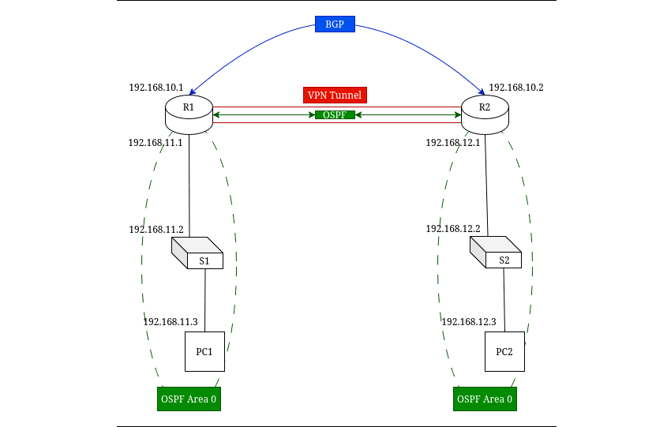

**~ The Talented Mr. *VPN* ~** <sub><sup>by Patricia Highsmith</sup></sub>

---

# VPN

## SUMMARY

A VPN (Virtual Private Network) is a secure, encrypted connection that allows data to travel safely over a public or untrusted network.

| Type                   | Description                                                          | Example                                                       |
| ---------------------- | -------------------------------------------------------------------- | ------------------------------------------------------------- |
| **Site-to-Site VPN**   | Connects two entire networks securely over the Internet.             | Two company offices connected together.                       |
| **Remote Access VPN**  | Connects a single remote user to a private network.                  | An employee working from home connects to the office network. |
| **Client-to-Site VPN** | A variation of remote access where users connect using VPN software. | Cisco AnyConnect, OpenVPN.                                    |

---

## CONFIGUARATION



> ***BGP*** : Simulates WAN routing between service providers (R1↔R2)\
> ***GRE/IPsec Tunnel*** : Creates a secure “overlay” network over that WAN\
> ***OSPF*** : Handles internal LAN routing across the VPN

---

**SETUP BGP**

- To simulate a WAN link between R1 & R2, BGP is setup.
- Each router needs an Autonomous System Number (ASN).
    + R1 --> 65001
    + R2 --> 65002

1 - Configure BGP on R1.
```
R1(conf)# router bgp 65001
R1(conf-router)# bgp log-neighbor-changes
R1(conf-router)# neighbor 192.168.10.2 remote-as 65002
R1(conf-router)# network 192.168.11.0 mask 255.255.255.0
```

2 - Configure BGP on R2.
```
R1(conf)# router bgp 65002
R1(conf-router)# bgp log-neighbor-changes
R1(conf-router)# neighbor 192.168.10.1 remote-as 65001
R1(conf-router)# network 192.168.12.0 mask 255.255.255.0
```

3 - Verify BGP Peering.
```
R1# show ip bgp summary
```
> BGP neighbor should be (192.168.10.2) in the Established state.

4 - Test Route Exchange.
```
R1# show ip route bgp
```

---

**SETUP VPN TUNNEL**

1 - Tunnel Types,
- GRE Tunnel : Simple to set up, supports routing protocols inside it.
- IPsec Tunnel : Encrypts traffic, often used with GRE for both routing and encryption.

> First add GRE then add IPSec on top.

---

2 - Configure GRE Tunnel Between R1 and R2.

R1
```
R1(conf)# interface Tunnel0
R1(config-if)# ip address 192.168.10.1 255.255.255.252
R1(config-if)# tunnel source GigabitEthernet0/0       # WAN interface toward R2
R1(config-if)# tunnel destination 192.168.10.2
R1(config-if)# tunnel mode gre ip
```

R2
```
R2(conf)# interface Tunnel0
R2(config-if)# ip address 192.168.10.2 255.255.255.252
R2(config-if)# tunnel source GigabitEthernet0/0       # WAN interface toward R1
R2(config-if)# tunnel destination 192.168.10.1
R2(config-if)# tunnel mode gre ip
```

---

3 - Integrate OSPF over the Tunnel.

R1
```
R1(conf)# router ospf 1
R1(conf-router)# network 192.168.10.0 0.0.0.3 area 0
R1(conf-router)# network 192.168.11.0 0.0.0.255 area 0
```

R2
```
R1(conf)# router ospf 1
R2(conf-router)# network 192.168.10.0 0.0.0.3 area 0
R2(conf-router)# network 192.168.12.0 0.0.0.255 area 0
```

---

4 - Add IPsec Encryption

**PHASE 1 (Configure ISAKMP)**

R1
```
R1# configure terminal
R1(config)# crypto isakmp policy 10
R1(config-isakmp)# encr aes 256
R1(config-isakmp)# hash sha256
R1(config-isakmp)# authentication pre-share
R1(config-isakmp)# group 14
R1(config-isakmp)# lifetime 86400
R1(config-isakmp)# exit

R1(config)# crypto isakmp key MY_SHARED_KEY address 2.2.2.2
```

R2
```
R2# configure terminal
R2(config)# crypto isakmp policy 10
R2(config-isakmp)# encr aes 256
R2(config-isakmp)# hash sha256
R2(config-isakmp)# authentication pre-share
R2(config-isakmp)# group 14
R2(config-isakmp)# lifetime 86400
R2(config-isakmp)# exit

R2(config)# crypto isakmp key MY_SHARED_KEY address 1.1.1.1
```

**PHASE 2 (Configure IPsec Transform Set)**

R1
```
R1(config)# crypto ipsec transform-set TS1 esp-aes 256 esp-sha-hmac
R1(cfg-crypto-trans)# mode tunnel
R1(cfg-crypto-trans)# exit
```

R2
```
R2(config)# crypto ipsec transform-set TS1 esp-aes 256 esp-sha-hmac
R2(cfg-crypto-trans)# mode tunnel
R2(cfg-crypto-trans)# exit
```

**PHASE 3 (Define Interesting Traffic)**

R1
```
R1(config)# access-list 100 permit ip 192.168.1.0 0.0.0.255 192.168.2.0 0.0.0.255
```

R2
```
R2(config)# access-list 100 permit ip 192.168.2.0 0.0.0.255 192.168.1.0 0.0.0.255
```

**PHASE 4 (Create Crypto Map)**

R1
```
R1(config)# crypto map VPN-MAP 10 ipsec-isakmp
R1(config-crypto-map)# set peer 2.2.2.2
R1(config-crypto-map)# set transform-set TS1
R1(config-crypto-map)# match address 100
R1(config-crypto-map)# exit
```

R2
```
R2(config)# crypto map VPN-MAP 10 ipsec-isakmp
R2(config-crypto-map)# set peer 1.1.1.1
R2(config-crypto-map)# set transform-set TS1
R2(config-crypto-map)# match address 100
R2(config-crypto-map)# exit
```

**PHASE 5 (Apply Crypto Map to the Outbound Interface)**

R1
```
R1(config)# interface GigabitEthernet0/0
R1(config-if)# ip address 1.1.1.1 255.255.255.0
R1(config-if)# crypto map VPN-MAP
R1(config-if)# exit
```

R2
```
R2(config)# interface GigabitEthernet0/0
R2(config-if)# ip address 2.2.2.2 255.255.255.0
R2(config-if)# crypto map VPN-MAP
R2(config-if)# exit
```

---

## MONITORING & MAINTENANCE

| **Category**                       | **Command**                         | **Description / Purpose**                                          |
| ---------------------------------- | ----------------------------------- | ------------------------------------------------------------------ |
| **Monitoring OSPF**                | `show ip ospf neighbor`             | Displays OSPF neighbor relationships and their states.             |
|                                    | `show ip route ospf`                | Shows routes learned via OSPF in the routing table.                |
| **Monitoring VPN / Crypto**        | `show crypto isakmp sa`             | Displays current IKE (ISAKMP) Security Associations (Phase 1).     |
|                                    | `show crypto ipsec sa`              | Displays current IPsec Security Associations (Phase 2).            |
|                                    | `show crypto map`                   | Shows crypto map configurations applied to interfaces.             |
| **Debugging**                      | `debug crypto isakmp`               | Enables debugging for ISAKMP (Phase 1) negotiations.               |
|                                    | `debug crypto ipsec`                | Enables debugging for IPsec (Phase 2) operations.                  |
| **Stopping Debugs**                | `undebug all`                       | Stops all active debugging processes.                              |
|                                    | `no debug all`                      | Alternative command to stop all debugging.                         |
| **Clearing Security Associations** | `clear crypto isakmp sa`            | Deletes all current IKE SAs, forcing Phase 1 renegotiation.        |
|                                    | `clear crypto ipsec sa`             | Resets all IPsec tunnels; useful after configuration changes.      |
|                                    | `clear crypto session`              | Resets both ISAKMP and IPsec SAs for all peers.                    |
|                                    | `clear crypto session peer 2.2.2.2` | Resets both ISAKMP and IPsec SAs for the specified peer (2.2.2.2). |
