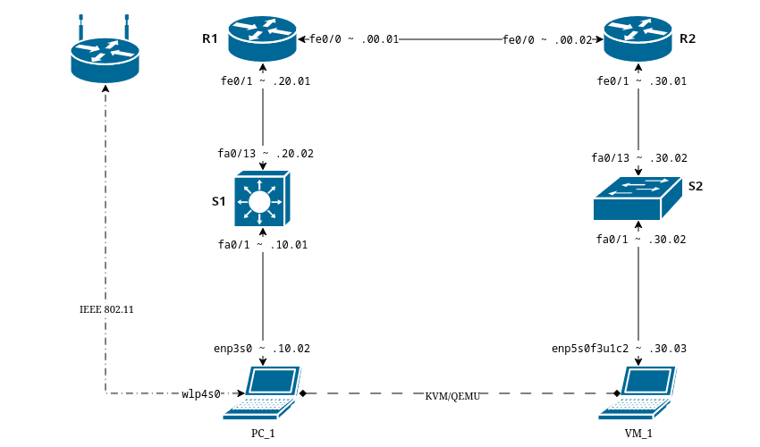

# NOC / SOC HomeLAB

## ⚙️ **Establishing The Lab Environment**

**Hardware**

+ **1800 Series Routers** x 2
+ **Cisco Catalyst 2960** x 1
+ **Cisco Catalyst 3750 v2** x 1
+ **USB Network adapter** x 2

**Network Topography**

**Tools**

* Linux (Operating System)
* KVM + QEMU (Virtualization Platform)
* Wireshark (Packet Analyzer)
* Splunk (SIEM / Log Analysis Platform)
* rsyslog (Syslog Server)

---

## 📡 **Networking Fundamentals Practicals**

(*Back to Basics*)

💡 **Key Skills**

* OSI and TCP/IP models
* IP addressing, subnets, VLANs
* Routing protocols: OSPF, EIGRP, BGP
* Switching: STP, EtherChannel, VLANs
* NAT, ACLs, DHCP

🎲 **Activities**

* Configured a small multi-router topology with static and dynamic routing
* Created VLANs and inter-VLAN routing
* Simulated ACLs and firewall rules
* Intentionally misconfigure STP (root bridge priority) and recover
* Configure and test Port Security (sticky MAC, violation modes) and BPDU Guard / PortFast
* Capture STP, ARP and DHCP traffic in Wireshark
* Simulate a rogue switch and observe STP behavior
* Introduce routing black holes and troubleshoot (`traceroute`, `debug ip routing`,  CEF tables)
* Redistribute routes between different routing protocols
* Configure DHCP relay (`ip helper-address`) across VLANs
* Simulate DHCP exhaustion and recovery
* Implement NAT overload vs static NAT and compare packet captures
* Shut down uplinks and observe convergence time
* Change routing metrics and watch traffic shift paths
---

## 📈 **Network Monitoring / NOC Practicals**

( *Visibility, Uptime and Troubleshooting* )

💡 **Key Skills**

* SNMP, NetFlow, sFlow, and telemetry
* Syslog collection and analysis
* Interface monitoring (errors, utilization)
* Alerts and dashboards (Solar Winds)

🎲 **Activities**

* Configure SNMP and NetFlow on routers/switches
* Configure SNMP traps (link up/down) instead of polling only
* Simulate outages and monitor alerts
* Build dashboards showing interface utilization and network performance
* Create baseline metrics:
    + Normal CPU
    + Normal interface utilization
    + Normal error rates
* Observe alerts and tune thresholds to reduce noise
* Correlate alerts with syslog timestamps
* Send syslog to Splunk and:
  + Identify interface errors
  + Detect config changes
  + Track device reboots
* Create saved searches for:
  + Interface down events
  + Authentication failures
  + Spanning-tree topology changes
* Create a NOC-style runbook:
  + “Interface Down”
  + “High CPU”
  + “Packet Loss”
---

## 🛡 **Security Operations / SOC Practicals**

( *Analyzing threats and responding* )

💡 **Key Skills**

* Firewalls and ACLs
* IDS/IPS basics (Suricata)
* Log collection and SIEM (Splunk)
* Packet capture and malware traffic analysis (Wireshark)
* Threat hunting and mapping techniques ( MITREATTACK/ NIST CSF)

🎲 **Activities**

* Send test malicious traffic through your network and observe logs
* Configure and tune IDS/IPS rules
* Capture and analyze suspicious packets
* Create dashboards showing security events
* Generate known attack traffic:
  + Nmap scans
  + Brute-force SSH attempts
  + Suspicious DNS queries
* Validate Suricata alerts against packet captures
* Write custom Suricata rules for:
  + Port scans
  + ICMP tunneling
  + Suspicious outbound traffic
* Build Splunk dashboards:
  * Top source IPs
  * Failed logins over time
  * Lateral movement indicators
* Hunt for:
  * Beaconing behavior (regular intervals)
  * Abnormal east-west traffic
  * New services listening on unexpected ports
* Map findings to:
  * MITRE ATT&CK techniques
  * NIST CSF functions (Detect, Respond)
* Create a full incident workflow:
  1. Detection (alert fires)
  2. Triage (packet/log review)
  3. Containment (ACL / shutdown port)
  4. Eradication (block IP, reset creds)
  5. Lessons learned
* Deploy a low-interaction honeypot
* Detect interaction via logs and IDS
* Harden Cisco devices:
  * Disable unused services
  * Secure management plane
  * Log all config changes
