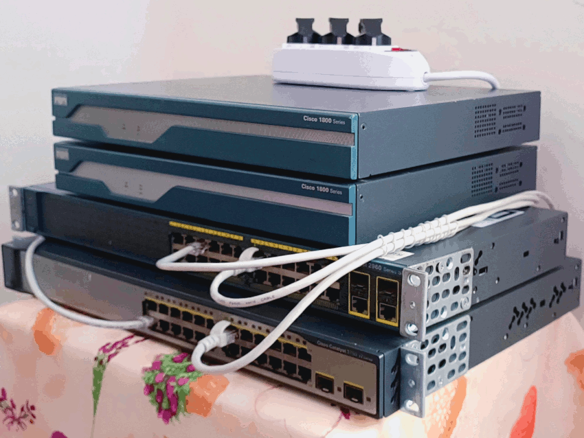
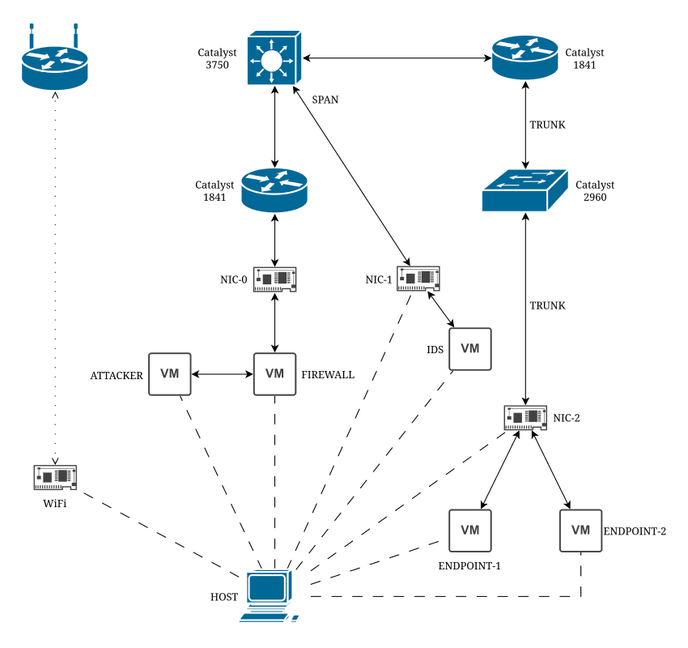
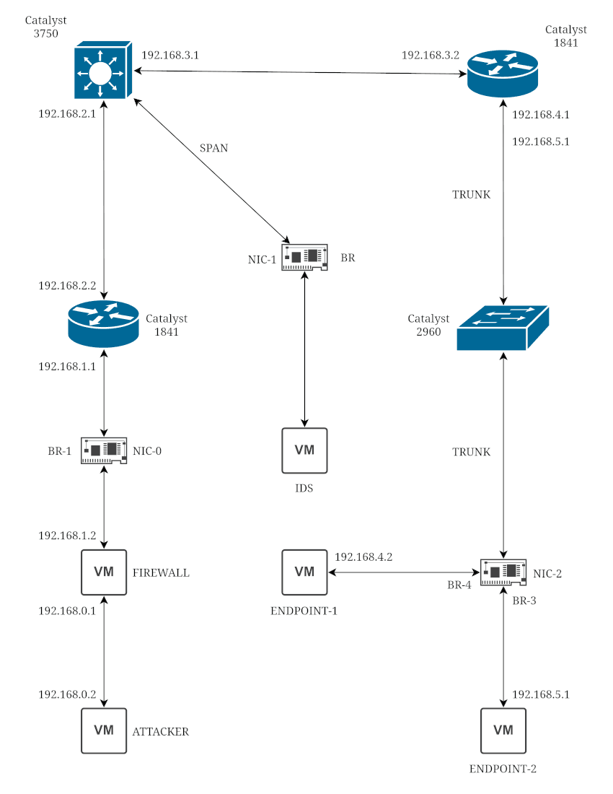

# NOC / SOC HomeLAB

### **Hardware**

+ **Cisco Catalyst 1841 Routers** x 2
+ **Cisco Catalyst 2960 Switch** x 1
+ **Cisco Catalyst 3750 Switch** x 1
+ **Network Interface Cards** x 3
+ **Acer Aspire 7 Laptop** x 1

### **Software**

* Operating Systems
    + Arch Linux (Host/Attacker)
    + IPFire (Firewall)
    + Metasploitable2 (Endpoint)
* KVM/QEMU (Virtualization Platform)
* Wireshark (Packet Analyzer)
* Splunk (SIEM)
* Suricata (IPS/IDS)
* Cisco Packet Tracer (for Large Network Simulations)

### **Base Network Topography**

|Network Segment|Subnet|
|-|-|
| Attacker <-> Firewall | 192.168.0.0/24 |
| Firewall <-> C-1841   | 192.168.1.0/24 |
| C-1841 <-> C-3750     | 192.168.2.0/24 |
| C-3750 <-> C-1841     | 192.168.3.0/24 |
| C-1841 <-> Endpoint-1 | 192.168.4.0/24 |
| C-1841 <-> Endpoint-2 | 192.168.5.0/24 |

---

## 📡 **Networking Fundamentals Labs**

**Skills Explored**

* OSI and TCP/IP models
* IP addressing, subnets, VLANs
* Routing protocols: OSPF, EIGRP, BGP
* Switching: STP, EtherChannel, VLANs
* NAT, ACLs, DHCP

**Activities**

* 1-01 Configured a small multi-router topology with static and dynamic routing
* 1-02 Created VLANs and inter-VLAN routing
* 1-03 Simulated ACLs and firewall rules
* 1-04 Intentionally misconfigure STP (root bridge priority) and recover
* 1-05 Configure and test Port Security (sticky MAC, violation modes) and BPDU Guard / PortFast
* 1-06 Capture STP, ARP and DHCP traffic in Wireshark
* 1-07 Simulate a rogue switch and observe STP behavior
* 1-08 Introduce routing black holes and troubleshoot (`traceroute`, `debug ip routing`,  CEF tables)
* 1-09 Redistribute routes between different routing protocols
* 1-10 Configure DHCP relay (`ip helper-address`) across VLANs
* 1-11 Simulate DHCP exhaustion and recovery
* 1-12 Implement NAT overload vs static NAT and compare packet captures
* 1-13 Shut down uplinks and observe convergence time
* 1-14 Change routing metrics and watch traffic shift paths
---

## 📈 **Network Operations Labs**

**Skills Explored**

* SNMP, NetFlow, sFlow and telemetry
* Syslog collection and analysis
* Interface monitoring (errors, utilization)
* Alerts and dashboards (Zabbix)

**Activities**

* 2-01 Configure SNMP and NetFlow on routers/switches
* 2-02 Configure SNMP traps (link up/down) instead of polling only
* 2-03 Simulate outages and monitor alerts
* 2-04 Build dashboards showing interface utilization and network performance
* 2-05 Create baseline metrics:
    + Normal CPU
    + Normal interface utilization
    + Normal error rates
* 2-06 Observe alerts and tune thresholds to reduce noise
* 2-07 Correlate alerts with syslog timestamps
* 2-08 Send syslog to Splunk and:
  + Identify interface errors
  + Detect config changes
  + Track device reboots
* 2-09 Create saved searches for:
  + Interface down events
  + Authentication failures
  + Spanning-tree topology changes
* 2-10 Create a NOC-style runbook:
  + “Interface Down”
  + “High CPU”
  + “Packet Loss”
---

## **Network Security Labs**

**Skills Explored**

* Firewalls and ACLs
* Switch Hardening
* IDS/IPS basics (Suricata)
* Log collection and SIEM (Splunk)
* Packet capture and malware traffic analysis (Wireshark)
* Threat hunting and mapping techniques ( MITRE ATT&CK/ NIST CSF)

**Activities**

* **3-01 Map existing network. --> DONE**
* 3-02 Send test malicious traffic through the network and observe logs
* 3-03 Configure and tune IDS/IPS rules
* 3-04 Capture and analyze suspicious packets
* 3-05 Create dashboards showing security events
* 3-06 Generate known attack traffic:
  + Nmap scans
  + Brute-force SSH attempts
  + Suspicious DNS queries
* 3-07 Validate Suricata alerts against packet captures
* 3-08 Write custom Suricata rules for:
  + Port scans
  + ICMP tunneling
  + Suspicious outbound traffic
* 3-09 Build Splunk dashboards:
  * Top source IPs
  * Failed logins over time
  * Lateral movement indicators
* 3-10 Hunt for:
  * Beaconing behavior (regular intervals)
  * Abnormal east-west traffic
  * New services listening on unexpected ports
* 3-11 Map findings to:
  * MITRE ATT&CK techniques
  * NIST CSF functions (Detect, Respond)
* 3-12 Create a full incident workflow:
  1. Detection (alert fires)
  2. Triage (packet/log review)
  3. Containment (ACL / shutdown port)
  4. Eradication (block IP, reset creds)
  5. Lessons learned
* 3-13 Deploy a low-interaction honeypot
* 3-14 Detect interaction via logs and IDS
* **3-15 Harden Cisco devices --> DONE**
  * portsecurity
  * dhcp snooping
  * dynamic arp inspection
  * ip source guard
  * protected ports
  * stp root guard
  * stp bpdu guard
  * storm control
